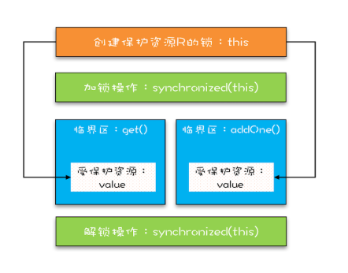
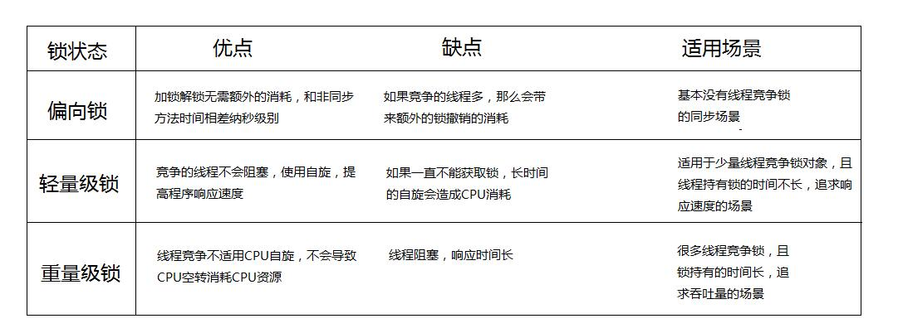

# Synchronized

## 1. 为什么使用Synchronized

- 存在共享数据

- 多个线程同时操作共享数据

synchronized可以保证再同一时刻只有一个线程可以执行某个方法或者代码块，同时syn保证了**可见性**。

## 2. 实现原理

synchronized可以保证方法或者代码块在运行时，**同一时刻只有一个方法可以进入到临界区**，同时它还可以保证共享变量的内存可见性。



## 3. Synchronized的使用

```java
class X {
  // 修饰非静态方法
  synchronized void foo() {
    // 临界区
  }
  // 修饰静态方法
  synchronized static void bar() {
    // 临界区
  }
  // 修饰代码块
  Object obj = new Object()；
  void baz() {
    synchronized(obj) {
      // 临界区
    }
  }
} 
```

- 对于普通同步方法，锁是当前实例对象

  ```java
  class X {
    // 修饰非静态方法
    synchronized(this) void foo() {
      // 临界区
    }
  }
  ```

- 对于**静态**同步方法，锁是当前类的Class对象，类锁

  ```java
  class X {
    // 修饰静态方法
    synchronized(X.class) static void bar() {
      // 临界区
    }
  }
  ```

- 对于同步方法块，锁是Synchronized括号里配置的对象


## 4. 如何实现加锁：

### 4.1 Java对象的构成：

- 对象头
  - 标记字段：hashcode、分代年龄、**锁标志位**
  - 类型指针：让虚拟机确定是哪个类的实例
- 实例数据：类的数据，父类的信息
- 对齐填充：8个字节对齐

### 4.2 synchronized如何做到有序性、可见性、原子性？

#### as-if-serial 语义

- as-if-serial 语义的意思指：不管怎么重排序（编译器和处理器为了提高并行度），（单线程）程序的执行结果不能被改变。
- 编译器，runtime 和处理器都必须遵守as-if-serial 语义。为了遵守 as-if-serial 语义，编译器和处理器不会对存在数据依赖关系的操作做重排序，因为这种重排序会改变执行结果。
- 但是，如果操作之间不存在数据依赖关系，这些操作就可能被编译器和处理器重排序。 

java中通过synchronized提供的锁机制，**确保了在加锁和解锁过程中的逻辑执行是单线程的**，也就满足了符合as-if-serial语义，从而实现了有序性。

#### 可见性

JMM关于synchronized的两条规定：

- 线程解锁前，必须把共享变量的最新值刷新到主内存中

- 线程加锁时，将清空工作内存中共享变量的值，从而使用共享变量时需要从主内存中重新获取最新的值

  （注意：加锁与解锁需要是同一把锁）

   通过以上两点，可以看到synchronized能够实现可见性。

#### 原子性

确保同一时间只有一个线程能拿到锁，能够进入代码块

### 4.3 synchronized具有的特性

#### 可重入

当一个线程再次请求自己持有对象锁的临界资源时，这种情况属于重入锁。注意由于synchronized是基于monitor实现的，因此每次重入，monitor中的计数器仍会加1。

#### 不可中断

不可中断就是指，一个线程获取锁之后，另外一个线程处于阻塞或者等待状态，前一个不释放，后一个也一直会阻塞或者等待，不可以被中断。

#### 同步代码

**monitorenter 和 monitorexit**

- 进入一个人方法的时候，执行**monitorenter**，就会获取当前对象的一个所有权，这个时候monitor进入数为1，当前的这个线程就是这个monitor的owner。
- 如果你已经是这个monitor的owner了，你再次进入，就会把进入数+1.
- 同理，当他执行完**monitorexit**，对应的进入数就-1，直到为0，才可以被其他线程持有。

所有的互斥，其实在这里，就是看你能否获得monitor的所有权，一旦你成为owner就是获得者。

#### 同步方法

- 同步方法的实现不是基于monitorenter和monitorexit指令来实现的
- 在运行时常量池里通过**ACC_SYNCHRONIZED**来区分是否是同步方法，方法执行时会检查该标志
- 当一个方法有这个标志的时候，进入的线程首先需要获得监视器才能执行该方法
- 方法结束或者抛异常时会释放监视器(monitor)


## 5. 锁升级

锁的4中状态：无锁状态、偏向锁状态、轻量级锁状态、重量级锁状态（级别从低到高）

**自旋锁**：是指当一个线程在获取锁的时候，如果锁已经被其它线程获取，那么该线程将循环等待，然后不断的判断锁是否能够被成功获取，直到获取到锁才会退出循环。获取锁的线程一直处于活跃状态，但是并没有执行任何有效的任务。

优点：

* 自旋锁不会使**线程状态**发生切换，一直处于用户态，即线程一直都是active的；不会使线程进入阻塞状态，减少了不必要的上下文切换，执行速度快。

**偏向锁：**锁总是由同一个线程多次获得。当一个线程访问同步块并获取锁时，会在对象头和栈帧中的**锁记录里存储锁偏向的线程ID**，偏向锁是一个可重入的锁。（所以当其他线程尝试竞争偏向锁时，持有偏向锁的线程才会释放锁）

**轻量级锁**：轻量级锁考虑的是竞争锁对象的线程不多，而且线程持有锁的时间也不长的情景。因此这个时候就干脆不阻塞这个线程，让它**自旋**这等待锁释放。

**重量级锁**：通过对象内部的监视器(monitor)实现，其中monitor的本质是依赖于底层操作系统的Mutex Lock实现，操作系统实现线程之间的切换需要从**用户态到内核态**的切换，切换成本非常高。线程竞争不使用自旋，不会消耗CPU。但是线程会进入阻塞等待被其他线程被唤醒，响应时间缓慢。


