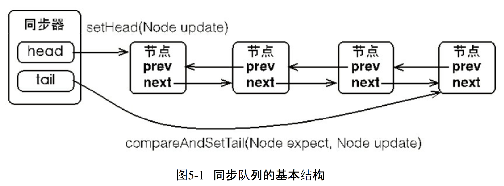

# 1. 自己实现锁

## 1.1 CAS

java.util.concurrent包中借助**CAS**实现了区别于synchronouse同步锁的一种乐观锁。

CAS有3个操作数，内存值V，旧的预期值A，要修改的新值B。当且仅当预期值A和内存值V相同时，将内存值V修改为B，否则什么都不做。

## 1.2 自旋

```java
public class SpinLock {
    //原子引用线程
    AtomicReference<Thread> atomicReference = new AtomicReference<>();


    public void mylock() {
        Thread thread = Thread.currentThread();
        System.out.println(Thread.currentThread().getName() + "\t come in");
        // 自旋获取锁
        while (!atomicReference.compareAndSet(null, thread)) {

        }
    }

    public void myUnlock() {
        Thread thread = Thread.currentThread();
        // CAS解锁
        atomicReference.compareAndSet(thread, null);
        System.out.println(Thread.currentThread().getName()+"\t invoked myunlock()");
    }
}
```

缺点：耗费CPU资源，没有竞争到锁的线程会一直占用CPU资源进行CAS操作。

## 1.3 Park

park可以做到即时 阻塞线程和唤醒线程。

```java
public class SpinLock {
    // 原子引用线程
    AtomicReference<Thread> atomicReference = new AtomicReference<>();
    // 阻塞线程队列
    Queue<Thread> parkQueue = new LinkedBlockingQueue<>();

    public void mylock() {
        System.out.println(Thread.currentThread().getName() + "\t come in");
        // 自旋获取锁
        while (!atomicReference.compareAndSet(null, thread)) {
            park();
        }
    }

    public void myUnlock() {
        Thread thread = Thread.currentThread();
        // CAS解锁
        atomicReference.compareAndSet(thread, null);
        System.out.println(Thread.currentThread().getName()+"\t invoked myunlock()");
        lock_notify();
    }
    
    public void park() {
        parkQueue.add(Thread.currentThread());
        LockSupport.park(Thread.currentThread());
    }
    
    public void unpark() {
        Thread t = parkQueue.poll();
        LockSupport.unpark(t);
    }
}
```

# 2. AbstractQueuedSynchronizer

## 2.1 FIFO队列

同步器依赖内部的同步队列（一个FIFO双向队列）来完成同步状态的管理，当前线程获取同步状态失败时，同步器会将**当前线程以及等待状态等信息**构造成 为一个节点（Node）并将其加入同步队列，同时会阻塞当前线程，当同步状态释放时，会把首节点中的线程唤醒，使其再次尝试获取同步状态。



Node:

```java
public class Node{
    // 等待状态，若值为-1，表示后继节点处于等待状态
    volatile int waitStatus;
    volatile AbstractQueuedSynchronizer.Node prev;
    volatile AbstractQueuedSynchronizer.Node next;
    // 当前持有锁的线程
    volatile Thread thread;
}
```

AbstractQueuedSynchronizer：

```Java
// 列头
private transient volatile AbstractQueuedSynchronizer.Node head;
// 列尾
private transient volatile AbstractQueuedSynchronizer.Node tail;
// 状态
private volatile int state;
```

## 2.2 同步状态的获取

调用**aquire(1)**方法：

```java
public final void acquire(int arg) {
    // 尝试获取同步器tryAcquire false--> 入队addWaiter --> park阻塞该线程acquireQueued
    if (!tryAcquire(arg) &&
        acquireQueued(addWaiter(Node.EXCLUSIVE), arg))
        selfInterrupt();
}
```

