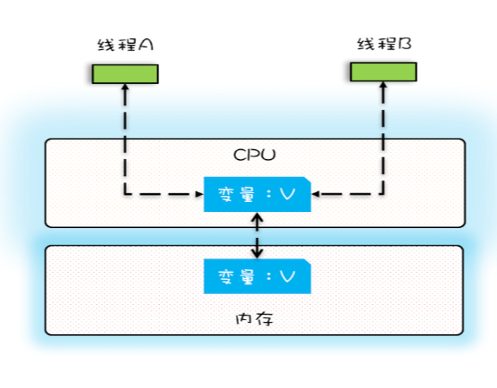
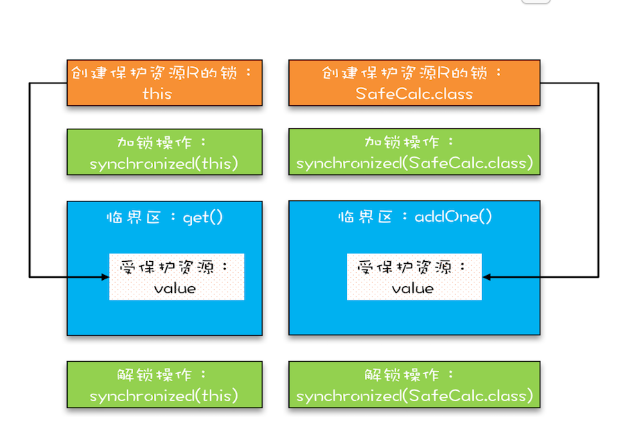

# 一、可见性、原子性和有序性

## 1. 可见性



一个线程对共享变量的修改，另外一个线程能够立刻看到，我们称为**可见性。**对于单核机器来说，线程操作了同一个CPU的缓存，所以修改是可见的。


多核机器修改的是不同CPU的缓存，因此，修改不是可见的。

```java
public class Test {
  private long count = 0;
  private void add10K() {
    int idx = 0;
    while(idx++ < 10000) {
      count += 1;
    }
  }
  public static long calc() {
    final Test test = new Test();
    // 创建两个线程，执行 add() 操作
    Thread th1 = new Thread(()->{
      test.add10K();
    });
    Thread th2 = new Thread(()->{
      test.add10K();
    });
    // 启动两个线程
    th1.start();
    th2.start();
    // 等待两个线程执行结束
    th1.join();
    th2.join();
    return count;
  }
}
```

最终的值，小于2000

## 2. 原子性

术语：

|   术语名称   |          英文          |                 解释                  |
| :----------: | :--------------------: | :-----------------------------------: |
|    缓存行    |       Cache line       |          缓存操作的最小单位           |
|  比较并交换  |    Compare and Swap    |               比较交换                |
|  CPU流水线   |      CPU pipeline      |       电路单元组成的指令流水线        |
| 内存顺序冲突 | Memory order violation | 多个CPU同时修改同一个缓存行的不同部分 |

单核多进程，在CPU上进行**时间片**轮转：


正在进行IO操作的进程可以让出**CPU的使用权**（标记为休眠状态）

高级语言里一条语句往往需要多条 CPU 指令完成：count += 1

- 从内存加载变量到寄存器
- 执行+1操作
- 结果写入内存

操作系统可以在**任一CPU指令**执行完，进行**任务切换**。

## 3. 有序性

编译器为了优化性能，有时候会改变程序中语句的先后顺序。

new指令的顺序：

1. 分配内存M
2. 内存M的地址赋值给变量
3. 在M上实例化对象

```java
// 双重检查创建单例对象
public class Singleton {
  static Singleton instance;
  static Singleton getInstance(){
    if (instance == null) {
      synchronized(Singleton.class) {
        if (instance == null)
          instance = new Singleton();
        }
    }
    return instance;
  }
}
```


如果在赋值的时候发生**任务切换**，那么就会发生**空指针异常**

## 问题

在 32 位的机器上对 long 型变量进行加减操作存在并发隐患的原因：

long类型64位，所以在32位的机器上，对long类型的数据操作通常需要多条指令组合出来，无法保证原子性，所以并发的时候会出问题🌝🌝🌝


# 二、Java如何解决可见性和有序性

线程间如何通信，如何同步？

##  1. Java内存模型

Java之间的通信由Java内存模型控制，线程之前的共享变量存在主内存，另外线程有自己的私有内存。

可见性的原因是**CPU缓存**，有序性的原因是**编译优化**，解决这两个问题的方案是**按需禁用缓存以及编译优化**。

Java 内存模型规范了 JVM 如何提供按需禁用缓存和编译优化的方法，具体来说，这些方法包括 **volatile**、**synchronized** 和 **final** 三个关键字，以及六项 **Happens-Before 规则**。

## 2. volatile

1. 将当前处理器缓存行的数据写回内存
2. 这个写回内存的操作使得其他CPU缓存了该内存地址的数据无效

## 3. synchronized

加锁

## 4. final

final修饰的变量不可变，可以做优化

## 5. Happens-Before 规则

1. **程序的顺序性**：程序前面对某个变量的修改一定是对后续操作可见的
2. **volatile 变量规则**：如果一个线程先去写一个volatile变量，然后一个线程去读这个变量，那么这个写操作的结果一定对读的这个线程可见。（写操作， Happens-Before 于后续读操作）
3. **传递性**： 如果A Happens-Before B，且 B Happens-Before C，那么 A Happens-Before C

4. **管程锁**：对于**同一个锁**来说，一个线程对这个锁解锁之后，另一个线程获取了这个锁都能看到前一个线程的操作结果！(管程是一种通用的同步原语，synchronized就是管程的实现）
5. **线程start()**：在主线程A执行过程中，启动子线程B，那么线程A在启动子线程B之前对共享变量的修改结果对线程B可见。
6. **线程join()**：它是指主线程 A 等待子线程 B 完成（主线程 A 通过调用子线程 B 的 join() 方法实现），当子线程 B 完成后（主线程 A 中 join() 方法返回），主线程能够看到子线程的操作。


# 三、 解决原子性 互斥锁

synchronized

当修饰静态方法的时候，锁定的是当前**类的 Class 对象**。

当修饰非静态方法的时候，锁定的是**当前实例对象 this**。

```java
class X {
  // 修饰非静态方法
  synchronized void foo() {
    // 临界区
  }
  // 修饰静态方法
  synchronized static void bar() {
    // 临界区
  }
  // 修饰代码块
  Object obj = new Object()；
  void baz() {
    synchronized(obj) {
      // 临界区
    }
  }
}  
```


synchronized必须锁住同一个对象才有**互斥性**

```java
class SafeCalc {
  static long value = 0L;
  // 实例锁 this
  synchronized long get() {
    return value;
  }
  
  // 对象锁
  synchronized static void addOne() {
    value += 1;
  }
}
```



使用不同的锁可以锁不同的资源


# 四、死锁

### 死锁发生的四个条件

1. 互斥使用：即当资源被一个线程使用(占有)时，别的线程不能使用
2. 不可抢占：资源请求者不能强制从资源占有者手中夺取资源，资源只能由资源占有者主动释放。
3. 请求与保持：资源请求者在请求其他的资源的同时保持对原有资源的占有
4. 循环等待：存在一个等待环路

**也就是说只要我们破坏其中一个，就可以成功避免死锁的发生**。

其中，互斥这个条件我们没有办法破坏，因为我们用锁为的就是互斥。不过其他三个条件都是有办法破坏掉的，到底如何做呢？

1. 对于“占用且等待”这个条件，我们可以一次性申请所有的资源，这样就不存在等待了。
2. 对于“不可抢占”这个条件，占用部分资源的线程进一步申请其他资源时，如果申请不到，可以主动释放它占有的资源，这样不可抢占这个条件就破坏掉了。
3. 对于“循环等待”这个条件，可以靠按序申请资源来预防。所谓按序申请，是指资源是有线性顺序的，申请的时候可以先申请资源序号小的，再申请资源序号大的，这样线性化后自然就不存在循环了。


# 五、等待-通知

在并发程序中，当一个线程进入临界区后，由于某些条件不满足，需要进入等待状态，Java 对象的 wait() 方法就能够满足这种需求。如上图所示，当调用 wait() 方法后，当前线程就会被阻塞，并且进入到右边的等待队列中，**这个等待队列也是互斥锁的等待队列**。 线程在进入等待队列的同时，**会释放持有的互斥锁**，线程释放锁后，其他线程就有机会获得锁，并进入临界区了。

那线程要求的条件满足时，该怎么通知这个等待的线程呢？很简单，就是 Java 对象的 notify() 和 notifyAll() 方法。我在下面这个图里为你大致描述了这个过程，当条件满足时调用 notify()，会通知等待队列（**互斥锁的等待队列**）中的线程，告诉它**条件曾经满足过**。

```java
// 一个范式
while(条件不满足){
    wait();
}
```

