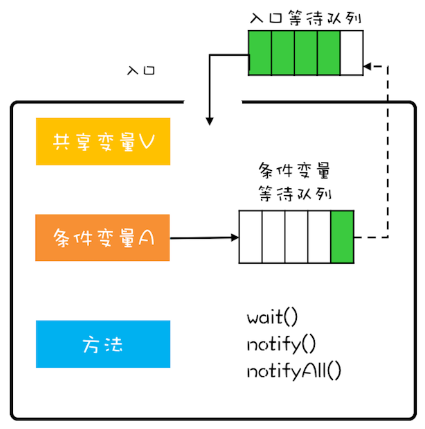

# 管程

**管程**，通过管理类的成员变量和成员方法，让这个类变成**线程安全**的。


## Mesa模型



管程可以解决并发领域的两大核心问题：

- **互斥**：同一时刻只允许一个线程访问共享资源
- **同步**：线程间如何通信、协作


如何解决互斥：

将**共享变量**的操作都封装起来，对**共享变量的访问**指定并发访问策略。

```java
public class Counter{
    private long value;
    
    synchronized long get(){
        return value;
    }
    
    synchronized long addOne(){
        return ++value;
    }
}
```


如何解决同步：

- 条件变量：决定线程执行或等待，（Java 语言内置的管程里只有一个条件变量）
- 等待队列：通过wait，notify，notifyAll三个操作，实现进入队列和通知队列中的线程

**wait范式**

```java
while(条件不满足){
    wait();
}
```

