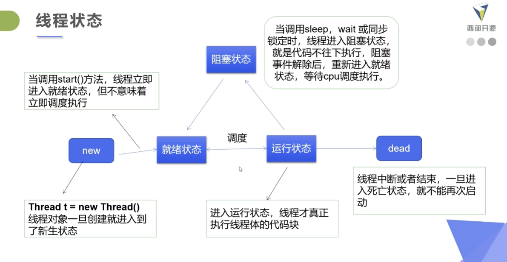

# 线程状态

创建：new

就绪：调用start，等待调度

运行：Runnable CPU调度

阻塞：Blocked Waiting Time_Waiting

​			锁定状态，阻塞解除后进入**就绪**

死亡：Terminated

# 线程方法

|方法|说明|
|-|-|
|setPriority|更改优先级|
|sleep|休眠，抛出异常|
|join|等待该线程终止，插队|
|yield|暂停正在执行的线程，执行其它线程，礼让|
|interrupt|中断，不推荐|
|isAlive|测试活动状态|

## 1. 线程应该自己停止

**1. 线程正常停止**

**2. 建议使用标志位**

**3. 不使用过时方法**

通过标志位+外部方法使得线程停下来

```java
public class TestStop implements Runnable{
    private boolean flag = true;

    @Override
    public void run() {
        int i = 0;
        while (flag){
            System.out.println("run: " + i++);
        }
    }

    public void stop(){
        this.flag = false;
    }

    public static void main(String[] args) {
        TestStop testStop = new TestStop();
        new Thread(testStop).start();

        for (int i = 0; i < 1000; i++) {
            System.out.println("main:"+i);
            if(i == 900){
                // stop切换标志位停止
                testStop.stop();
                System.out.println("Stop");
            }
        }
    }
}
```

## 2. 线程休眠

要点：

1. 指定阻塞时间
2. 异常`InterruptException`
3. 到达线程后进入就绪状态
4. 模拟网络延时
5. **sleep不会释放锁**

**案例：**模拟网络延时，放大问题的发生性

```java
public class TestSleep implements Runnable{

    private int nums = 10;

    @Override
    public void run() {
        while (true){
            if(nums <= 0) break;

            try{ // 模拟时延
                Thread.sleep(100);
            } catch (InterruptedException e){
                e.printStackTrace();
            }

            System.out.println(Thread.currentThread().getName()+" 拿到了第："+nums--);
        }
    }

    public static void main(String[] args) {
        TestThread testThread = new TestThread();

        new Thread(testThread,"A").start();
        new Thread(testThread,"B").start();
        new Thread(testThread,"C").start();
    }
}
```

**案例2：**计时器

```java
public class TestSleep2 {
    public static void main(String[] args) {

        while (true){
            try {
                Date start = new Date(System.currentTimeMillis());
                System.out.println(new SimpleDateFormat("HH:mm:ss").format(start));
                Thread.sleep(1000);
            } catch (InterruptedException e){
                e.printStackTrace();
            }
        }
    }
}
```

## 3. 线程礼让

说明：

1. 线程**暂停，但不是阻塞**
2. 运行变为就绪
3. CPU重新调度，不一定成功

```java
public class TestYield {
    public static void main(String[] args) {
        MyYield myYield = new MyYield();

        new Thread(myYield, "a").start();
        new Thread(myYield, "b").start();
    }

}

class MyYield implements Runnable{

    @Override
    public void run() {
        System.out.println(Thread.currentThread().getName()+" Start");
        Thread.yield();
        System.out.println(Thread.currentThread().getName()+" End");
    }
}

// a Start
// b Start
// a End
// b End
```

## 4. 线程插队

插队线程执行完毕之后，主线程才能执行

```java
public class TestJoin {
    public static void main(String[] args) throws InterruptedException {
        MyJoinThread testJoin = new MyJoinThread();

        Thread thread = new Thread(testJoin,"Join");
        thread.start();

        for (int i = 0; i < 200; i++) {
            if(i == 100){
                thread.join();
            }
            System.out.println("main "+i);
        }
    }
}

class MyJoinThread implements Runnable{

    @Override
    public void run() {
        for (int i = 0; i < 100; i++) {
            System.out.println(Thread.currentThread().getName()+i);
        }
    }
}
```

## 5. 线程死亡

Thread.TERMINATED

线程死亡之后不能再运行，线程不能使用两次



# 线程优先级

线程优先级决定调度哪个线程来执行

getPriority()

setPriority(int newPriority)

优先级的设定建议再start调度前

