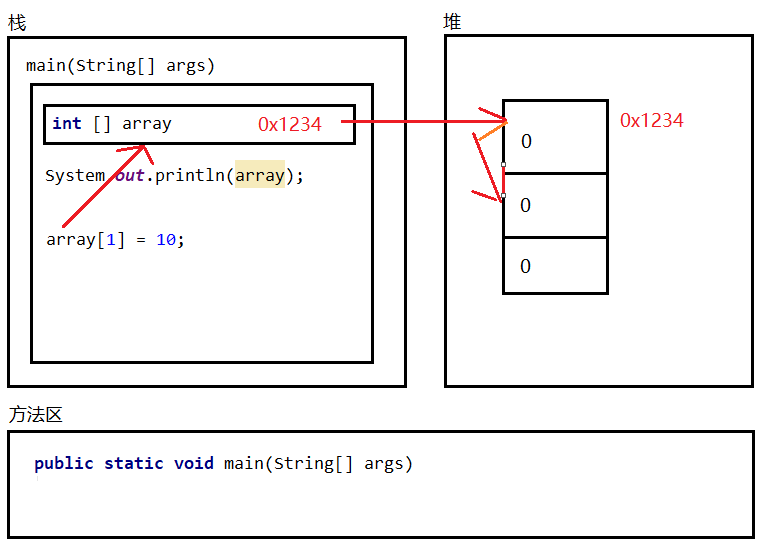
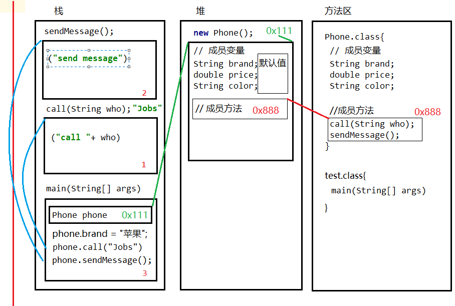

## 实例

### 1 创建数组的内存图

```java
public class test {
    public static void main(String[] args) {
        int [] array = new int[3];
        System.out.println(array);
        System.out.println("=============");

        array[1] = 10;
        array[2] = 20;
        System.out.println(array);
        System.out.println(array[0]);
        System.out.println(array[1]);
        System.out.println(array[2]);
    }
}
```



### 2 创建对象的内存图

```java
public class test {
    public static void main(String[] args) {
        Phone phone = new Phone();
        System.out.println(phone.brand); //null
        System.out.println(phone.price); //0.0
        System.out.println(phone.color); //null
        phone.brand = "苹果";
        phone.price = 8388.0;
        phone.color = "black";
        System.out.println(phone.brand); //null
        System.out.println(phone.price); //0.0
        System.out.println(phone.color); //null
        phone.call("Jobs");
        phone.sendMessage();
    }
}

class Phone{
    String brand;
    double price;
    String color;
    public void call(String who){
        System.out.println("call "+ who);
    }
    public void sendMessage(){
        System.out.println("send message");
    }
}
```

