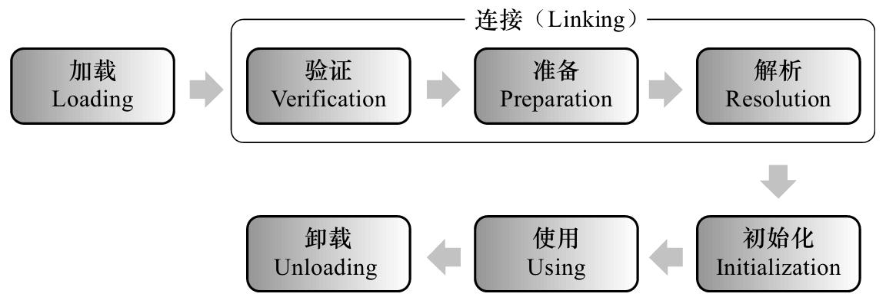

# 04 加载类机制

整个生命周期将会经历加载（Loading）、验证（Verification）、准备（Preparation）、解析（Resolution）、初始化（Initialization）、使用（Using）和卸载（Unloading）七个阶段

## 4.1 类加载时机




**加载、验证、准备、初始化和卸载**这五个阶段的顺序是确定的，类型的加载过程必须按照这种顺序**按部就班地开始**，而解析阶段则不一定：它在某些情况下可以在初始化阶段之后再开始，这是为了支持Java语言的运行时绑定特性（也称为**动态绑定**或晚期绑定）。

触发**初始化**的时机：

1. new、getstatic、putstatic或invokestatic四条字节码指令
   * new关键字实例化对象的时候
   * 读取或设置一个类型的静态字段（被final修饰、已在编译期把结果放入常量池的静态字段除外）
   * 调用一个类型的静态方法的时候
2. 对类型进行反射调用的时候
3. 初始化类的时候，如果发现其父类还没有进行过初始化，则需要先触发其**父类的初始化**。
4. 当虚拟机启动时，用户需要指定一个要执行的主类（包含main()方法的那个类），虚拟机会先初始化这个主类。
5. JDK 8被default关键字修饰的接口方法
6. JDK 7新加入的动态语言支持时

除此之外，所有引用类型的方式都不会触发初始化，称为被动引用。

* 通过子类引用父类的静态字段，不会导致**子类的初始化**
* 通过数组定义引用类，不会导致类初始化
* 通过类引用常量字段

## 4.2 类加载的过程

### 4.2.1 加载

1. 获取类的二进制字节流
2. 将这个字节流所代表的静态存储结构转化为方法区的运行时数据结构
3. 在内存中生成一个代表这个类的java.lang.Class对象，作为方法区这个类的各种数据的访问入口

对于数组类而言，情况就有所不同，数组类本身不通过**类加载器创建**，是由Java虚拟机直接在内存中动态构造出来的。数组类的元素类型最终还是要靠类加载器来完成加载。

加载阶段结束后，Java虚拟机外部的二进制字节流就按照虚拟机所设定的格式存储在**方法区**之中了

**加载之后，class就进入方法区啦啦啦啦**

### 4.2.2 验证

连接的第一步，目的是确保Class文件的字节流中包含的信息符合《Java虚拟机规范》的全部约束要求。

验证阶段大致上会完成下面四个阶段的检验动作：

**1. 文件格式验证：**魔数，版本号，常量池....

**2. 元数据验证：**语义分析，（有父类，不能继承不被继承的类，抽象类实现所有方法）

**3. 字节码验证：**确定程序语义是合法的、符合逻辑的

**4. 符号引用验证：**

### 4.2.3 准备

**准备阶段**是正式为类中定义的变量（即静态变量，被static修饰的变量）分配内存并设置类变量初始值的阶段。

### 4.2.4 解析

解析阶段是Java虚拟机将常量池内的符号引用替换为直接引用的过程。

### 4.2.5 初始化

直到初始化阶段，Java虚拟机才真正开始执行类中编写的Java程序代码。

初始化阶段就是执行**类构造器**`<clinit>()`方法的过程。

`<clinit>()`方法是由编译器自动收集类中的所有**类变量**的

* 赋值动作
* 静态语句块（static{}块）中的语句，静态语句块中只能访问到定义在静态语句块之前的变量

合并产生的

`<clinit>()`方法与**类的构造函数**（即在虚拟机视角中的实例构造器`<init>()`方法）**不同**

> Java虚拟机会保证在子类的`<clinit>()`方法执行前，父类的`<clinit>()`方法已经执行完毕。因此在Java虚拟机中第一个被执行的`<clinit>()`方法的类型肯定是java.lang.Object。

由于父类的`<clinit>()`方法先执行，也就意味着父类中定义的**静态语句块要优先**于子类的变量赋值操作。

如果一个类中没有静态语句块，也没有对**类变量**的赋值操作，那么编译器可以不为这个类生成`<clinit>()`方法。

## 4.3 类加载器（Class Loader）

> 在 Java 虚拟机中，类的唯一性是由类加载器实例以及类的全名一同确定的

**1. 实现类加载的过程**

对于任意一个类，都必须由加载它的**类加载器和这个类**本身一起共同确立其在Java虚拟机中的唯一性。比较两个类是否“相等”，只有在这两个类是由同一个类加载器加载的前提下才有意义。

**2. 双亲委派模型**

类加载器：

1. 启动类加载器：这个类加载器使用C++语言实现，**虚拟机自身**的一部分，加载核心类库
2. 扩展类加载器：独立于虚拟机外部，一种Java系统类库的扩展机制
3. 应用程序类加载器：如果应用程序中没有自定义过自己的类加载器，一般情况下这个就是程序中默认的类加载器。

```java
ClassLoader classLoader = ClassLoaderTest.class.getClassLoader();
System.out.println(classLoader);

ClassLoader classLoader1 = classLoader.getParent();
System.out.println(classLoader1);

ClassLoader parent = classLoader1.getParent();
System.out.println(parent);

ClassLoader loader = String.class.getClassLoader();
System.out.println(loader);
```

```
jdk.internal.loader.ClassLoaders$AppClassLoader@78308db1
jdk.internal.loader.ClassLoaders$PlatformClassLoader@5fd0d5ae
null
null
```

工作过程：如果一个类加载器收到了类加载的请求，它首先不会自己去尝试加载这个类，而是把这个请求委派给父类加载器去完成，每一个层次的类加载器都是如此，因此所有的加载请求最终都应该传送到最顶层的启动类加载器中，只有当父加载器反馈自己无法完成这个加载请求（它的搜索范围中没有找到所需的类）时，子加载器才会尝试自己去完成加载。