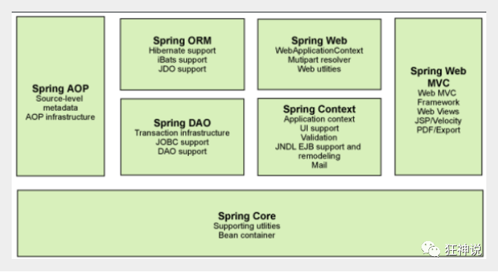

# Spring

Spring是一个轻量级的**控制反转(IoC)和面向切面(AOP)的容器（框架）。**

Spring 框架是一个分层架构，由 7 个定义良好的模块组成。Spring 模块构建在核心容器之上，核心容器定义了创建、配置和管理 bean 的方式 .

**组成**

组成 Spring 框架的每个模块（或组件）都可以单独存在，或者与其他一个或多个模块联合实现。每个模块的功能如下：

- **Core模块**：**IOC容器，解决对象创建和之间的依赖关系**。核心容器提供 Spring 框架的基本功能。核心容器的主要组件是BeanFactory，它是工厂模式的实现。BeanFactory 使用*控制反转*（IOC） 模式将应用程序的配置和依赖性规范与实际的应用程序代码分开。
- **Spring 上下文**：Spring 上下文是一个配置文件，向 Spring 框架提供上下文信息。Spring 上下文包括企业服务，例如 JNDI、EJB、电子邮件、国际化、校验和调度功能。
- **Spring AOP**：通过配置管理特性，Spring AOP 模块直接将面向切面的编程功能 , 集成到了 Spring 框架中。所以，可以很容易地使 Spring 框架管理任何支持 AOP的对象。Spring AOP 模块为基于 Spring 的应用程序中的对象提供了事务管理服务。通过使用 Spring AOP，不用依赖组件，就可以将声明性事务管理集成到应用程序中。
- **Spring DAO**：JDBC DAO抽象层提供了有意义的异常层次结构，可用该结构来管理异常处理和不同数据库供应商抛出的错误消息。异常层次结构简化了错误处理，并且极大地降低了需要编写的异常代码数量（例如打开和关闭连接）。Spring DAO 的面向 JDBC 的异常遵从通用的 DAO 异常层次结构。
- **Spring ORM**：Spring 框架插入了若干个 ORM 框架，从而提供了 ORM 的对象关系工具，其中包括 JDO、Hibernate 和 iBatis SQL Map。所有这些都遵从 Spring 的通用事务和 DAO 异常层次结构。
- **Spring Web 模块**：Web 上下文模块建立在应用程序上下文模块之上，为基于 Web 的应用程序提供了上下文。所以，Spring 框架支持与 Jakarta Struts 的集成。Web 模块还简化了处理多部分请求以及将请求参数绑定到域对象的工作。
- **Spring MVC 框架**：MVC 框架是一个全功能的构建 Web 应用程序的 MVC 实现。通过策略接口，MVC 框架变成为高度可配置的，MVC 容纳了大量视图技术，其中包括 JSP、Velocity、Tiles、iText 和 POI。

---

**Spring Boot与Spring Cloud**

- Spring Boot 是 Spring 的一套快速配置脚手架，可以基于Spring Boot 快速开发单个微服务;
- Spring Cloud是基于Spring Boot实现的；
- Spring Boot专注于快速、方便集成的单个微服务个体，Spring Cloud关注全局的服务治理框架；
- Spring Boot使用了约束优于配置的理念，很多集成方案已经帮你选择好了，能不配置就不配置 , Spring Cloud很大的一部分是基于Spring Boot来实现，Spring Boot可以离开Spring Cloud独立使用开发项目，但是Spring Cloud离不开Spring Boot，属于依赖的关系。
- SpringBoot在SpringClound中起到了承上启下的作用，如果你要学习SpringCloud必须要学习SpringBoot。

---

# Design Philosophy

- Provide choice at every level. Spring lets you defer design decisions as late as possible. For example, you can switch persistence providers through configuration without changing your code. The same is true for many other infrastructure concerns and integration with third-party APIs.
- Accommodate diverse perspectives. Spring embraces flexibility and is not opinionated about how things should be done. It supports a wide range of application needs with different perspectives.
- Maintain strong backward compatibility. Spring’s evolution has been carefully managed to force few breaking changes between versions. Spring supports a carefully chosen range of JDK versions and third-party libraries to facilitate maintenance of applications and libraries that depend on Spring.
- Care about API design. The Spring team puts a lot of thought and time into making APIs that are intuitive and that hold up across many versions and many years.
- Set high standards for code quality. The Spring Framework puts a strong emphasis on meaningful, current, and accurate javadoc. It is one of very few projects that can claim clean code structure with no circular dependencies between packages.

---

# 面试题

## 1. 谈谈对IOC和AOP的理解

### IOC

**IOC（Inversion Of Controll，控制反转）**是一种设计思想，就是将原本在程序中手动创建对象的控制权，交由给Spring框架来管理。**IOC容器**是Spring用来实现IOC的载体，IOC容器实际上就是一个Map(key, value)，Map中存放的是各种对象。

将对象之间的相互依赖关系交给IOC容器来管理，并由IOC容器完成对象的注入。IOC容器就像是一个工厂一样，当我们需要创建一个对象的时候，只需要配置好配置文件/注解即可，完全不用考虑对象是如何被创建出来的。

Spring时代我们一般通过XML文件来配置Bean，后来开发人员觉得用XML文件来配置不太好，于是Sprng Boot注解配置就慢慢开始流行起来。

### AOP

**AOP（Aspect-Oriented Programming，面向切面编程）**能够将那些与业务无关，却为业务模块所共同调用的逻辑或责任（例如事务处理、日志管理、权限控制等）封装起来，便于减少系统的重复代码，降低模块间的耦合度，并有利于未来的可扩展性和可维护性。

Spring AOP是基于动态代理的，如果要代理的对象实现了某个接口，那么Spring AOP就会使用JDK动态代理去创建代理对象；而对于没有实现接口的对象，就无法使用JDK动态代理，转而使用CGlib动态代理生成一个被代理对象的子类来作为代理。

### Spring中的bean的作用域有哪些？

1. singleton：唯一bean实例，Spring中的bean默认都是单例的。

2. prototype：每次请求都会创建一个新的bean实例。

3. request：每一次HTTP请求都会产生一个新的bean，该bean仅在当前HTTP request内有效。

4. session：每一次HTTP请求都会产生一个新的bean，该bean仅在当前HTTP session内有效。

### Spring中的单例bean的线程安全问题

当多个线程操作同一个对象的时候，对这个对象的非静态成员变量的写操作会存在线程安全问题。

* 在类中定义一个ThreadLocal成员变量，将需要的可变成员变量保存在ThreadLocal中，

  ThreadLocal而是一个线程内部的存储类，可以在指定线程内存储数据，数据存储以后，只有指定线程可以得到存储数据，官方解释如下。

### Bean的生命周期

不理解

### SpringMVC

MVC是一种设计模式，Spring MVC是一款很优秀的MVC框架。Spring MVC可以帮助我们进行更简洁的Web层的开发，并且它天生与Spring框架集成。Spring MVC下我们一般把后端项目分为Service层（处理业务）、Dao层（数据库操作）、Entity层（实体类）、Controller层（控制层，返回数据给前台页面）

