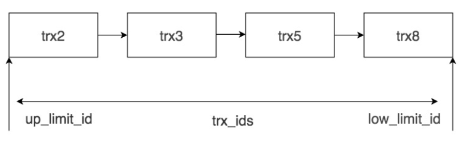

# 事务

## 1. 特性

事务就是保证一组数据库全部成功或者全部失败，事务支持是在InnoDB**引擎层**实现的

事务ACID（原子性，一致性，隔离性，持久性）

MySQL事务主要用来处理操作量大，复杂度高的数据。事务提交后要发出commit命令来生效，事务发生故障时，要发出rollback命令来回滚

### 1. 原子性（Atomicity）

**一个原子事务要么完整执行，要么干脆不执行。**这意味着，工作单元中的每项任务都必须正确执行。如果有任一任务执行失败，则整个工作单元或事务就会被终止。即此前对数据所作的任何修改都将被撤销。如果所有任务都被成功执行，事务就会被提交，即对数据所作的修改将会是永久性的。

### 2. 一致性（**Consistency**）

一致性指的就是数据库在进行事务操作后**，会由原来的一致状态，变成另一种一致的状态**。也就是说当事务提交后，或者当事务发生回滚后，数据库的完整性约束不能被破坏。

### 3. 隔离性（**Isolation**）

**隔离性意味着事务必须在不干扰其他进程或事务的前提下独立执行。**换言之，在事务或工作单元执行完毕之前，其所访问的数据不能受系统其他部分的影响。

### 4. 持久性（**Durability**）

**持久性表示在某个事务的执行过程中，对数据所作的所有改动都必须在事务成功结束前保存至某种物理存储设备。**这样可以保证，所作的修改在任何系统瘫痪时不至于丢失。

## 2. 读取问题

### 1. 脏读（读取未提交数据）

脏数据所指的就是未提交的数据。也就是说，一个事务正在对一条记录做修改，在这个事务完成并提交之前，这条数据是处于**待定状态**的（可能提交也可能回滚），这时，第二个事务来读取这条没有提交的数据，并据此做进一步的处理，就会产生**未提交的数据依赖关系**。这种现象被称为脏读。

| 时间 |            事务A             |              事务B               |
| :--: | :--------------------------: | :------------------------------: |
|  1   |                              |               开始               |
|  2   |             开始             |                                  |
|  3   |                              |       查询账户余额为200元        |
|  4   |                              |    取款1000元，余额改为1000元    |
|  5   |     查询账户余额为1000元     |                                  |
|  6   |                              | 取款发生错误，事务回滚，余额变更 |
|  7   | 转入2000元，余额修改为3000元 |                                  |
|  8   |           提交事务           |                                  |

*此时的余额应该为4000元*

### 2. 不可重复读（前后读取数据不一致）

一个事务先后读取同一条记录，而事务在两次读取之间该数据被其它事务所修改，则两次读取的数据不同，我们称之为不可重复读。

|时间顺序|事务A|事务B|
| :--: | :--------------------------: | :------------------------------:|
|1|开始事务|
|2|第一次查询，小明的年龄为20岁|
|3||开始事务|
|4|其他操作|
|5||更改小明的年龄为30岁|
|6||提交事务|
|7|第二次查询，小明的年龄为30岁|

*两次查询的数据不一致*

### 3. 幻读（前后多次读取，数据总量不一致）

一个事务(同一个read view)在前后两次查询同一范围的时候，后一次查询看到了前一次查询没有看到的行。*就像产生了幻觉一样，平白无故的多了几条数据，成为幻读。*

说明：

- 幻读专指**新插入的行**，读到原本存在行的更新结果不算。因为**当前读**的作用就是能读到所有已经提交记录的最新值。

|时间顺序|事务A|事务B|
|:--:|:--:|:--:|
|1|开始事务||
|2|第一次查询，数据总量为100条||
|3||开始事务|
|4|其他操作||
|5||新增100条数据|
|6||提交事务|
|7|第二次查询，数据总量为200条||

 *按照正确逻辑，事务A前后两次读取到的数据总量应该一致*

## 3. 事务的隔离级别

读未提交（Read uncommitted），读已提交（Read committed），可重复读（Repeatable read），可串行化（Serializable），用来解决数据库操作中产生的各种问题。

事务隔离级别包括

* 读未提交：一个事务在没有提交时候，他的变更就可以被其它事务看到

  读未提交可能会产生**脏读**的现象

* 读已经提交：所有事务只能读取其他事务已经提交的内容。

  解决了脏读，但是不能解决**不可重复读**

* 可重复读：所有事务前后多次的读取到的数据内容是不变的

  也就是某个事务在执行的过程中，**不允许其他事务进行update操作，但允许其他事务进行add操作**，造成某个事务前后多次读取到的数据总量不一致的现象，**从而产生幻读。**

* 可串行化：对于同一行记录，有写锁和读锁

  在这种隔离级别下，所有的事务顺序执行，所以他们之间不存在冲突。但是这样事务隔离级别，会导致大量的操作超时和锁竞争，从而大大降低数据库的性能。

## 具体实现

每条记录在更新的时候都会记录一条回滚操作


不同时刻启动的事务会对应不同的`read-view`

长事务会保留之前所有的回滚记录，使用`autocommit`提交，以及`commit work and chain`

回滚日志会在系统判断没有比这个日志更早的**视图**的时候

# 事务的常用语句

1. START TRANSACTION 或者 BEGIN，作用是显式开启一个事务。
2. COMMIT：提交事务。当提交事务后，对数据库的修改是永久性的。
3. ROLLBACK 或者 ROLLBACK TO [SAVEPOINT]，意为回滚事务。意思是**撤销正在进行的所有没有提交的修改**，或者将事务回滚到某个保存点。
4. SAVEPOINT：在事务中创建保存点，方便后续针对保存点进行回滚。一个事务中可以存在多个保存点。
5. RELEASE SAVEPOINT：删除某个保存点。
6. SET TRANSACTION，设置事务的隔离级别。

MySQL的事务**默认自动提交**：

```mysql
set autocommit = 0; #关闭自动提交
```

例子：

```mysql
CREATE TABLE test(name varchar(255), PRIMARY KEY (name)) ENGINE=InnoDB;
BEGIN;
INSERT INTO test SELECT '关羽';
COMMIT;
BEGIN;
INSERT INTO test SELECT '张飞';
INSERT INTO test SELECT '张飞';
ROLLBACK;
SELECT * FROM test;
```

completion_type 参数

1. completion=0，这是默认情况。也就是说当我们执行 COMMIT 的时候会提交事务，在执行下一个事务时，还需要我们使用 START TRANSACTION 或者 BEGIN 来开启。
2. completion=1，这种情况下，当我们提交事务后，相当于执行了 COMMIT AND CHAIN，也就是开启一个链式事务，即当我们提交事务之后会开启一个相同隔离级别的事务（隔离级别会在下一节中进行介绍）。
3. completion=2，这种情况下 COMMIT=COMMIT AND RELEASE，也就是当我们提交后，会自动与服务器断开连接。

# 事务隔离的实现方案

事务隔离的实现方案有两种，LBCC和MVCC

## LBCC

Based Concurrency Control

基于锁的并发控制，就是一个事务去读取一条数据的时候，就上锁，不允许其他事务来操作。（*效率低下*）

## MVCC

Multi Version Concurrency Control

多版本并发控制

通过数据行的多个版本管理来实现数据库的并发控制，可以解决的问题：

- 读写之间的阻塞问题，读写互相不阻塞
- 降低了死锁的概念，采用了乐观锁的方式（读不要加锁，写操作锁定必要的行）
- 解决一致性读的问题，通过快照的方式

### 快照读和当前读

快照读的实现基于MVCC

```sql
SELECT * FROM player WHERE ...
```

当前都就是读取记录的最新版本

```sql
/* 加锁的SELECT以及 增删改 */
SELECT * FROM player LOCK IN SHARE MODE;

SELECT * FROM player FOR UPDATE;
INSERT INTO player values ...
DELETE FROM player WHERE ...
UPDATE player SET ...
```

### InnoDB的MVCC

#### 1. 事务版本号

每开启一个事务，都会获得一个事务ID，它是自增的，因此大小反映了时间顺序。

#### 2. 行记录的隐藏列

InnoDB的叶子段存储了数据页，数据页中保持了行记录，行记录有隐藏字段：

- db_row_id：用于生成默认的**聚集索引**
- db_trx_id：操作这个数据的**事务id**
- db_roll_ptr：回滚指针，**指向Undo Log信息**

#### 3. Undo Log

InnoDB将**行记录快照**保存在了Undo Log里，回归指针将快照记录串联了起来，每个快照都保存了当时的事务id。


#### 4. Read View

在 MVCC 机制中，**多个事务**对**同一个行记录**进行更新会产生多个**历史快照**，这些历史快照保存在 **Undo Log** 里。

Read View 保存了当前事务开启时所有活跃（还没有提交）的事务列表， Read View 保存了不应该让这个事务看到的其他的事务 ID 列表。

Read View：

1. trx_ids，系统当前正在**活跃的事务** ID 集合。
2. low_limit_id，活跃的事务中**最大**的事务 ID。
3. up_limit_id，活跃的事务中**最小**的事务 ID。
4. creator_trx_id，**创建这个 Read View 的事务 ID。**

假设当前事务`creator_trx_id`想要读取行记录，这个行记录的事务 ID 为 trx_id：

- trx_id<up_limit_id：说明该行记录在这些活跃事务创建前就提交了，因此行记录对该事务可见。

- trx_id>low_limit_id：这说明该行记录在这些活跃的事务创建之后才创建，那么这个行记录对当前事务不可见。

- up_limit_id < trx_id < low_limit_id：对trx_ids进行遍历查找trx_id是否还在，若不在则已经提交了。



### MVCC流程

---

案例：

|  事务1   |  事务2   |  事务3   |  事务4   |
| :------: | :------: | :------: | :------: |
| 事务开始 | 事务开始 | 事务开始 | 事务开始 |
|   ...    |   ...    |   ...    |  已提交  |
|  进行中  |  快照读  |  进行中  |          |
|   ...    |   ...    |   ...    |          |

这个例子里，Read View就是：

| up_limit_id | trx_list | low_limit_id |
| :---------: | :------: | :----------: |
|      1      |   1、3   |    4+1=5     |

由于只有事务4修改过记录，当前的undo log如图：

|| 行id | 事务id | 回滚指针  | 字段 |
| :--: | :--: | :----: | :-------: | :--: |
|事务2|  1   |   4    | 0x6543212 |  A   |
|undo|  1   |   X    | 0x1234567 |  X   |

事务2只是读，因此**最新数据的事务id是事务4**

4不小于1，4不大于5，4不在list中间

符合可见性条件，所以事务4修改后提交的最新结果对事务2快照读时是可见的。

---

当查询一条记录的时候，系统如何通过多版本并发控制技术找到它：

1. 首先获取事务自己的版本号，也就是事务 ID；
2. 获取Read View；
3. 查询得到的数据，然后与 Read View 中的事务版本号进行比较；
4. 如果不符合 ReadView 规则，就需要从 Undo Log 中获取历史快照；
5. 最后返回符合规则的数据。

MVCC 是通过 Undo Log + Read View 进行数据读取，Undo Log 保存了历史快照，而 Read View 规则帮我们判断当前版本的数据是否可见。

## InnoDB如何解决幻读

**可重复读的情况**下，InnoDB 可以通过 Next-Key 锁 +MVCC 来解决幻读问题。

InnoDB的三种行锁：

1. 记录锁：针对单个行记录添加锁，`SELECT c1 FROM t WHERE c1 = 10 FOR UPDATE`防止其它事务更新，删除，插入`t.c1=10`的行。

2. 间隙锁：可以帮我们锁住一个范围（索引之间的空隙），但不包括记录本身。

   > A gap lock is a lock on a gap between index records, or a lock on the gap before the first or after the last index record.For example, `SELECT c1 FROM t WHERE c1 BETWEEN 10 and 20 FOR UPDATE;` prevents other transactions from inserting a value of `15` into column `t.c1`, whether or not there was already any such value in the column, because the gaps between all existing values in the range are locked.

3. Next-Key锁：帮我们锁住一个范围，同时锁定记录本身，相当于间隙锁 + 记录锁，可以解决幻读的问题。

## **要点**

1. 记录锁、间隙锁、临键锁，都属于排它锁；
2. 记录锁就是锁住一行记录；
3. 间隙锁只有在事务隔离级别 RR 中才会产生；
4. 唯一索引只有锁住多条记录或者一条不存在的记录的时候，才会产生间隙锁，指定给某条存在的记录加锁的时候，只会加记录锁，不会产生间隙锁；
5. 普通索引不管是锁住单条，还是多条记录，都会产生间隙锁；
6. 间隙锁会封锁该条记录相邻两个键之间的空白区域，防止其它事务在这个区域内插入、修改、删除数据，这是为了防止出现 幻读 现象；
7. 普通索引的间隙，优先以普通索引排序，然后再根据主键索引排序（多普通索引情况还未研究）；
8. 事务级别是RC（读已提交）级别的话，间隙锁将会失效。

---

#### 🌰举例

##### 表结构

```sql
SET NAMES utf8mb4;
SET FOREIGN_KEY_CHECKS = 0;

-- ----------------------------
-- Table structure for test
-- ----------------------------
DROP TABLE IF EXISTS `test`;
CREATE TABLE `test`  (
  `id` int(0) NOT NULL,
  `name` varchar(8) CHARACTER SET utf8 COLLATE utf8_general_ci NULL DEFAULT NULL,
  PRIMARY KEY (`id`) USING BTREE
) ENGINE = InnoDB CHARACTER SET = utf8 COLLATE = utf8_general_ci ROW_FORMAT = Dynamic;

-- ----------------------------
-- Records of test
-- ----------------------------
INSERT INTO `test` VALUES ('1', '小罗');
INSERT INTO `test` VALUES ('5', '小黄');
INSERT INTO `test` VALUES ('7', '小明');
INSERT INTO `test` VALUES ('11', '小红');

SET FOREIGN_KEY_CHECKS = 1;
```

test表存在的间隙是：

1. (-infinity, 1]
2. (1, 5]
3. (5, 7]
4. (7, 11]
5. (11, +infinity]

##### **记录锁**

记录锁锁住存在的数据：

```mysql
/* 开启事务1 */
BEGIN;
/* 查询 id = 5 的数据并加记录锁 */
SELECT * FROM `test` WHERE `id` = 5 FOR UPDATE;
/* 延迟30秒执行，防止锁释放 */
SELECT SLEEP(30);
/* 提交事务1，释放事务1的锁 */
COMMIT;
```

```mysql
BEGIN;
/* 事务2插入一条 name = '小张' 的数据 */
INSERT INTO `test` (`id`, `name`) VALUES (4, '小张'); # 正常执行
COMMIT;

BEGIN;
/* 事务3修改id=5的数据 */
UPDATE test set `name` = '小黄黄' WHERE id = 5; # 不能执行，需要等待事务1结束
COMMIT;
```

##### **间隙锁**

手动间隙锁

```mysql
/* 开启事务1 */
BEGIN;
/* 查询 id 在 5 - 7 范围的数据并加记录锁 */
SELECT * FROM `test` WHERE `id` BETWEEN 5 AND 7 FOR UPDATE;
/* 延迟30秒执行，防止锁释放 */
SELECT SLEEP(30);

# 注意：以下的语句不是放在一个事务中执行，而是分开多次执行，每次事务中只有一条添加语句

/* 事务2插入一条 id = 3，name = '小张1' 的数据 */
INSERT INTO `test` (`id`, `name`) VALUES (3, '小张1'); # 正常执行

/* 事务3插入一条 id = 4，name = '小白' 的数据 */
INSERT INTO `test` (`id`, `name`) VALUES (4, '小白'); # 正常执行

/* 事务4插入一条 id = 6，name = '小东' 的数据 */
INSERT INTO `test` (`id`, `name`) VALUES (6, '小东'); # 阻塞

/* 事务5插入一条 id = 8， name = '大罗' 的数据 */
INSERT INTO `test` (`id`, `name`) VALUES (8, '大罗'); # 正常执行

/* 提交事务1，释放事务1的锁 */
COMMIT;
```

记录锁锁住不存在数据：记录不存在时，会产生间隙锁，3在1~5之间

```mysql
/* 开启事务1 */
BEGIN;
/* 查询 id = 3 这一条不存在的数据并加记录锁 */
SELECT * FROM `test` WHERE `id` = 3 FOR UPDATE;
/* 延迟30秒执行，防止锁释放 */
SELECT SLEEP(30);

# 注意：以下的语句不是放在一个事务中执行，而是分开多次执行，每次事务中只有一条添加语句

/* 事务2插入一条 id = 3，name = '小张1' 的数据 */
INSERT INTO `test` (`id`, `name`) VALUES (3, '小张'); # 阻塞

/* 事务3插入一条 id = 4，name = '小白' 的数据 */
INSERT INTO `test` (`id`, `name`) VALUES (4, '小白'); # 阻塞

/* 事务4插入一条 id = 6，name = '小东' 的数据 */
INSERT INTO `test` (`id`, `name`) VALUES (6, '小东'); # 正常执行

/* 事务5插入一条 id = 8， name = '大罗' 的数据 */
INSERT INTO `test` (`id`, `name`) VALUES (8, '大罗'); # 正常执行

/* 提交事务1，释放事务1的锁 */
COMMIT;
```

##### **普通索引的间隙锁**

表

| id | num |
| :--: | :--: |
|  1   |  1   |
|  5   |  3   |
|  7   |  8   |
|  11  |  12  |

num上建立索引，索引间隙：

1. (-infinity, 1]
2. (1, 3]
3. (3, 8]
4. (8, 12]
5. (12, +infinity]

```mysql
/* 开启事务1 */
BEGIN;
SELECT * FROM `test1` WHERE `number` = 3 FOR UPDATE;
SELECT SLEEP(30);
COMMIT;
```

插入0，正常执行，插入1，2，4，都会被阻塞，插入8以后的都不阻塞

number (1 - 8) 的间隙中，插入语句都被阻塞了，


重新测试

插入（id，"num"）（2，1）、（3，2）、（6，8）、（8，8）、(9, 9)、(10, 12)

阻塞，阻塞，阻塞，执行，执行，执行

- 事务3添加 id = 6，number = 8 的数据，给阻塞了；
- 事务4添加 id = 8，number = 8 的数据，正常执行了。

number 相同时，会根据主键 id 来排序，所以：

1. 事务3添加的 id = 6，number = 8，这条数据是在 （3, 8） 的区间里边，所以会被阻塞；
2. 事务4添加的 id = 8，number = 8，这条数据则是在（8, 12）区间里边，所以不会被阻塞；

##### **临键锁(Next-key Locks)**

**临键锁**，是**记录锁与间隙锁的组合**，它的封锁范围，既包含索引记录，又包含索引区间。

---


