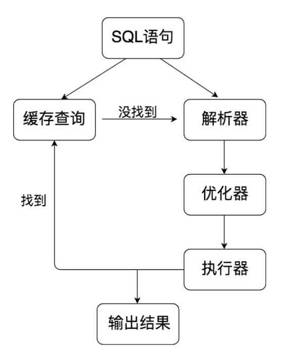

# MySQL

首先 MySQL 是**典型的 C/S 架构**，即 Client/Server 架构，服务器端程序使用的 mysqld。整体的 MySQL 流程如下图所示：


三层：

1. 连接层：接受SQL
2. SQL层：对语句进行处理
3. 存储引擎层：与数据库文件打交道，负责数据的存储和读取

## SQL层

SQL层与数据库文件的存储方式没有关系：




1. **查询缓存**：MySQL8.0 之后就抛弃了这个功能
2. 解析器：语法分析，语义分析
3. 优化分析：确定执行路径，根据全表搜索还是索引搜索
4. 执行器：**判断权限**之后执行

## 引擎层

1. InnoDB 存储引擎：它是 MySQL 5.5 版本之后默认的存储引擎，最大的特点是支持事务、行级锁定、外键约束等。
2. MyISAM 存储引擎：在 MySQL 5.5 版本之前是默认的存储引擎，不支持事务，也不支持外键，最大的特点是速度快，占用资源少。

# SQL建表

## 1. 创建表

```mysql
DROP TABLE IF EXISTS `player`;
CREATE TABLE `player`  (
  `player_id` int NOT NULL,
  `team_id` int NOT NULL,
  `player_name` varchar(255) CHARACTER SET utf8 COLLATE utf8_general_ci NOT NULL,
  `height` float(3, 2) NULL DEFAULT NULL,
  PRIMARY KEY (`player_id`) USING BTREE,
  UNIQUE INDEX `player_id`(`player_name`) USING BTREE
) ENGINE = InnoDB CHARACTER SET = utf8 COLLATE = utf8_general_ci ROW_FORMAT = Dynamic;

SET FOREIGN_KEY_CHECKS = 1;
```

## 2. 修改表

添加字段

```mysql
ALTER TABLE player ADD (age int(11));
```

修改字段名

```sql
ALTER TABLE player RENAME COLUMN age to player_age;
```

修改字段的数据类型

```mysql
ALTER TABLE player MODIFY (player_age float(3,1));
```

删除字段

```sql
ALTER TABLE player DROP COLUMN player_age;
```

## 3. 约束

主键约束

主键起的作用是唯一标识一条记录，不能重复，不能为空，即 UNIQUE+NOT NULL。一个数据表的主键只能有一个。主键可以是一个字段，也可以由多个字段复合组成。

外键约束

外键确保了表与表之间引用的完整性。**一个表中的外键对应另一张表的主键。**外键可以是重复的，也可以为空。

唯一性约束

唯一性约束表明了**字段在表中的数值是唯一的**，即使我们已经有了主键，还可以对其他字段进行唯一性约束。

需要注意的是，唯一性约束和普通索引（NORMAL INDEX）之间是有区别的。唯一性约束相当于创建了一个约束和普通索引，目的是保证字段的正确性，而普通索引只是提升数据检索的速度，并不对字段的唯一性进行约束。

NOT NULL约束

对字段定义了 NOT NULL，即表明该字段不应为空，必须有取值。

DEFAULT

表明了字段的默认值。如果在插入数据的时候，这个字段没有取值，就设置为默认值。比如我们将身高 height 字段的取值默认设置为 0.00，即`DEFAULT 0.00`

CHECK约束

用来检查特定字段取值范围的有效性，CHECK约束的结果不能为FALSE，比如我们可以对身高 height 的数值进行 CHECK 约束，必须≥0，且＜3，即`CHECK(height>=0 AND height<3)`

# 数据表设计的原则

1. 个数越少越好

2. 字段个数越少越好

3. 联合主键的字段个数越少越好

   联合主键中的字段越多，**占用的索引空间越大**，不仅会加大理解难度，还会增加运行时间和索引空间

4. 使用主键和外键越多越好

   数据库的设计实际上就是定义各种表，以及各种字段之间的关系。这些关系越多，证明这些实体之间的冗余度越低，利用度越高。


