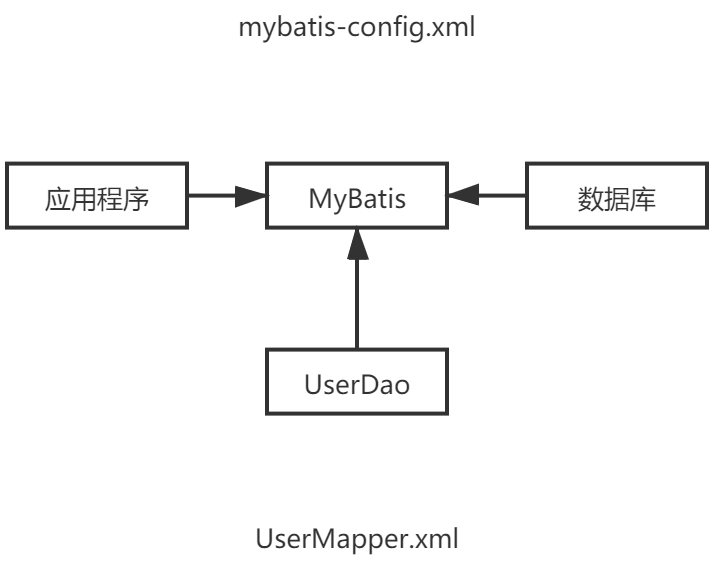
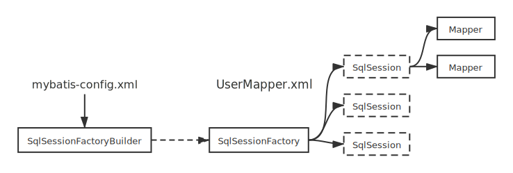

# Mybatis

# 1. 基础

### 1.1 定义


MyBatis 是一款优秀的**持久层**框架

[文档](https://mybatis.org/mybatis-3/zh/index.html)

```xml
<dependency>
  <groupId>org.mybatis</groupId>
  <artifactId>mybatis</artifactId>
  <version>x.x.x</version>
</dependency>
```

### 1.2 持久化

数据持久化

### 1.3 持久层

Dao，Service，Controller

- 完成持久化工作
- 层 是界限十分明显的

### 1.4 为什么

- 方便存入数据

- 传统的JDBC很复杂
- 不用这个也可以
- 简单灵活
- 解耦合

# 2. 第一个Mybatis



## 2.1 搭建环境

### 数据库搭建

```sql
CREATE DATABASE IF NOT EXISTS `mybatis`;

USE `mybatis`;

CREATE TABLE IF NOT EXISTS `user`(
	`id` INT(20) NOT NULL,
	`name` VARCHAR(30) DEFAULT NULL,
	`pwd` VARCHAR(30) DEFAULT NULL,
	PRIMARY KEY(id)
) ENGINE=INNODB DEFAULT CHARSET=utf8;

INSERT INTO `user`(`id`,`name`,`pwd`) VALUES
(1,'aa','123'),
(2,'bb','123'),
(3,'cc','123')
```

项目

```xml
<dependencies>
    <dependency>
        <groupId>mysql</groupId>
        <artifactId>mysql-connector-java</artifactId>
        <version>8.0.20</version>
    </dependency>
    <dependency>
        <groupId>org.mybatis</groupId>
        <artifactId>mybatis</artifactId>
        <version>3.5.2</version>
    </dependency>
    <dependency>
        <groupId>junit</groupId>
        <artifactId>junit</artifactId>
        <version>4.12</version>
    </dependency>
</dependencies>
```

## 2.1 创建模块

- **编写核心配置文件**

  创建mybatis-config.xml文件

  ```xml
  <configuration>
      <environments default="development">
          <environment id="development">
              <transactionManager type="JDBC"/>
              <dataSource type="POOLED">
                  <property name="driver" value="com.mysql.jdbc.Driver"/>
                  <property name="url" value="jdbc:mysql://49.233.50.91:3306/mybatis?useSSL=true&amp;useUnicode=true&amp;characterEncoding=UTF-8"/>
                  <property name="username" value="root"/>
                  <property name="password" value="mysql123"/>
              </dataSource>
          </environment>
      </environments>
  </configuration>
  ```

- **编写工具类**

  ```java
  public class MyBatisUtils {
  
      public static SqlSessionFactory sqlSessionFactory
      // 获取工厂类对象
      static {
          String resource = "org/mybatis/example/mybatis-config.xml";
          InputStream inputStream = null;
          try {
              inputStream = Resources.getResourceAsStream(resource);
          } catch (IOException e) {
              e.printStackTrace();
          }
          sqlSessionFactory = new SqlSessionFactoryBuilder().build(inputStream);
      }
  
      public static SqlSession getSqlSession(){
          return sqlSessionFactory.openSession();
      }
  }
  ```

- **编写代码**
  
  - 实体类
- Dao接口
  
```java
  public interface UserDao {
      List<User> getUserList();
  }
```

- **实现类**，由IMPL类转为Mapper配置文件

  ```xml
  <?xml version="1.0" encoding="UTF-8" ?>
  <!DOCTYPE mapper
          PUBLIC "-//mybatis.org//DTD Mapper 3.0//EN"
          "http://mybatis.org/dtd/mybatis-3-mapper.dtd">
  
  <mapper namespace="com.yang.dao.UserDao">
      <select id="getUserList" resultType="com.yang.pojo.User">
          select * from mybatis.user
      </select>
  </mapper>
  ```

- **测试**

    ```java
    public class UserDaoTest {
        @Test
        public void test(){
            SqlSession sqlSession = MyBatisUtils.getSqlSession();

            UserDao mapper = sqlSession.getMapper(UserDao.class);

            List<User> userList = mapper.getUserList();

            for (User user : userList) {
                System.out.println(user);
            }

            sqlSession.close();
        }
    }
    ```

# 3. CRUD

## 3.1 namespace

注意包名一致

## 3.2 select

选择，查询

- id：对应namespace的方法名
- resultType：sql语句的返回值
- parameterType：参数类型

步骤：

1. 编写接口

   ```java
   User getUserById(int id);
   ```

2. 编写mapper对应的sql语句

   ```xml
   <select id="getUserById" parameterType="int" resultType="com.yang.pojo.User">
           select * from mybatis.user where id = #{id}
   </select>
   ```

3. 测试

   ```java
   public void getUserById(){
       SqlSession sqlSession = MyBatisUtils.getSqlSession();
   
       UserMapper mapper = sqlSession.getMapper(UserMapper.class);
       User user1 = mapper.getUserById(1);
   
       System.out.println(user1);
   
   
       sqlSession.close();
   }
   ```

## 3.3 insert

## 3.4 update

## 3.5 delete

以上类似，记得提交事务

## 3.6 Map

```java
void addUser2(Map<String, Object> map);
```

```xml
<insert id="addUser2" parameterType="map">
    insert into mybatis.user (id,name,pwd) values (#{id},#{name},#{pwd});
</insert>
```

```java
@Test
public void addUser2(){
    SqlSession sqlSession = MyBatisUtils.getSqlSession();

    UserMapper mapper = sqlSession.getMapper(UserMapper.class);

    HashMap map = new HashMap<String, Object>();
    map.put("id",5);
    map.put("name","eee");
    map.put("pwd","123");

    mapper.addUser2(map);

    sqlSession.commit();
    sqlSession.close();
}
```

Map可以通过传递参数的方式，不用对象实例

## 3.7 模糊查询

在java代码执行的时候传递字符串


# 4. 配置解析

## 4.1 核心配置文件

MyBatis 的配置文件包含了会深深影响 MyBatis 行为的设置和属性信息。 配置文档的顶层结构如下：

- **configuration（配置）**

  - **properties（属性）**
  - **settings（设置）**
  - **typeAliases（类型别名）**
  - typeHandlers（类型处理器）
  - objectFactory（对象工厂）
  - plugins（插件）
  - **environments（环境配置）**
    - **environment（环境变量）**
      - **transactionManager（事务管理器）**
      - **dataSource（数据源）**

  - databaseIdProvider（数据库厂商标识）
  - **mappers（映射器）**

## 4.2 环境配置（environments）

MyBatis 可以配置成适应多种环境，**不过要记住：尽管可以配置多个环境，但每个 SqlSessionFactory 实例只能选择一种环境。**

environments 元素定义了如何配置环境。

```xml
<environments default="development">
  <environment id="development">
    <transactionManager type="JDBC">
      <property name="..." value="..."/>
    </transactionManager>
    <dataSource type="POOLED">
      <property name="driver" value="${driver}"/>
      <property name="url" value="${url}"/>
      <property name="username" value="${username}"/>
      <property name="password" value="${password}"/>
    </dataSource>
  </environment>
</environments>
```

注意一些关键点:

- 默认使用的环境 ID（比如：default="development"）；
- 每个 environment 元素定义的环境 ID（比如：id="development"）；
- 事务管理器的配置（比如：type="JDBC"）；
- 数据源的配置（比如：type="POOLED"）。

## 4.3 属性（properties）

properties可以引入其他文件，也可以直接写入子标签

```xml
<properties resource="org/mybatis/example/config.properties">
  <property name="username" value="dev_user"/>
  <property name="password" value="F2Fa3!33TYyg"/>
</properties>
```

然后再配置文件中使用：

```xml
<dataSource type="POOLED">
  <property name="driver" value="${driver}"/>
  <property name="url" value="${url}"/>
  <property name="username" value="${username}"/>
  <property name="password" value="${password}"/>
</dataSource>
```

## 4.4 类型别名（typeAliases）

类型别名可为 Java 类型设置一个缩写名字。 它仅用于 XML 配置，意在降低冗余的全限定类名书写。例如：

```xml
<typeAliases>
  <typeAlias alias="Author" type="domain.blog.Author"/>
  <typeAlias alias="Blog" type="domain.blog.Blog"/>
  <typeAlias alias="Comment" type="domain.blog.Comment"/>
  <typeAlias alias="Post" type="domain.blog.Post"/>
  <typeAlias alias="Section" type="domain.blog.Section"/>
  <typeAlias alias="Tag" type="domain.blog.Tag"/>
</typeAliases>
```

通过包名，在实体类很多的时候可以使用这种情况，但是第一种方案可以自定义别名

```xml
<typeAliases>
  <package name="domain.blog"/>
</typeAliases>
```

可以通过**注解**来自定义别名

```java
@Alias("author")
public class Author {
    ...
}
```

## 4.5 设置

<!---->

## 4.6 映射器

SQL 映射语句

```xml
<!-- 使用相对于类路径的资源引用 -->
<mappers>
  <mapper resource="org/mybatis/builder/AuthorMapper.xml"/>
  <mapper resource="org/mybatis/builder/BlogMapper.xml"/>
  <mapper resource="org/mybatis/builder/PostMapper.xml"/>
</mappers>

<!-- 使用映射器接口实现类的完全限定类名 -->
<!-- 使用这种方式：接口和配置文件必须同名同文件夹-->
<mappers>
  <mapper class="org.mybatis.builder.AuthorMapper"/>
  <mapper class="org.mybatis.builder.BlogMapper"/>
  <mapper class="org.mybatis.builder.PostMapper"/>
</mappers>

<!-- 将包内的映射器接口实现全部注册为映射器 -->
<!-- 使用这种方式：接口和配置文件必须同名同文件夹-->
<mappers>
  <package name="org.mybatis.builder"/>
</mappers>
```

## 4.7 作用域和生命周期



错误的使用会导致非常严重的**并发问题**

#### SqlSessionFactoryBuilder

这个类可以被实例化、使用和丢弃，**一旦创建了 SqlSessionFactory，就不再需要它**了。 因此 SqlSessionFactoryBuilder 实例的最佳作用域是**方法作用域**（也就是局部方法变量）。 你可以重用 SqlSessionFactoryBuilder 来创建多个 SqlSessionFactory 实例，但最好还是不要一直保留着它，以保证所有的 **XML 解析资源**可以被释放给更重要的事情。

#### SqlSessionFactory

SqlSessionFactory **一旦被创建就应该在应用的运行期间一直存在**，没有任何理由丢弃它或重新创建另一个实例。 使用 SqlSessionFactory 的最佳实践是在应用运行期间不要重复创建多次，多次重建 SqlSessionFactory 被视为一种代码“坏习惯”。因此 SqlSessionFactory 的最佳作用域是**应用作用域**。 有很多方法可以做到，最简单的就是使用**单例模式或者静态单例模式**。

#### SqlSession

**每个线程都应该有它自己的 SqlSession 实例**。SqlSession 的实例不是线程安全的，因此是不能被共享的，所以它的最佳的作用域是**请求或方法作用域**。 绝对不能将 SqlSession 实例的引用放在一个类的静态域，甚至一个类的实例变量也不行。 也绝不能将 SqlSession 实例的引用放在任何类型的托管作用域中

考虑将 SqlSession 放在一个和 HTTP 请求相似的作用域中。 换句话说，每次收到 HTTP 请求，就可以打开一个 SqlSession，返回一个响应后，就关闭它。 这个关闭操作很重要，为了确保每次都能执行关闭操作，你应该把这个关闭操作放到 finally 块中。

# 5.属性名和字段名不一致问题

```java
public class User {
    private int id;
    private String name;
    private String passwd;
}
```

resultMap

结果集映射


# 6. 日志工厂(settings)

## 6.2 logImpl

指定 MyBatis 所用日志的具体实现，未指定时将自动查找。

```xml
<settings>
	<setting name="logImpl" value="STDOUT_LOGGING"/>
</settings>
```

## 6.1 Log4j

可以通过配置文件精细的控制日志的生成过程，生成目的

导入

```xml
<dependencies>
    <dependency>
        <groupId>log4j</groupId>
        <artifactId>log4j</artifactId>
        <version>1.2.17</version>
    </dependency>
</dependencies>
```

配置

log4j.properties

设置级别

info debug error

# 7. 分页

**分页的目的：**

分页展示数据可以减少数据的处理量

## 7.1 Limit分页

```sql
select * from table limit startIndex, pageSize;
```

**Mybatis分页**

```java
// interface
List<User> getUserByLimit(Map<String, Integer> map);
```

```xml
<!--select-->
select * from table limit #{startIndex},#{pageSize}
```

```java
// test
// 构造map
map.put("startIndex", 0);
map.put("pageSize", 2);
// 传入mapper
mapper.getUserByLimit(map);

for (User user : userList) {
    System.out.println(user);
}
```

# 8. 注解

## 8.1 面向接口

## 8.2 使用注解

注解+绑定接口

```java
package org.mybatis.example;
public interface BlogMapper {
  @Select("SELECT * FROM blog WHERE id = #{id}")
  Blog selectBlog(int id);
}
```

本质：反射

底层：动态代理


