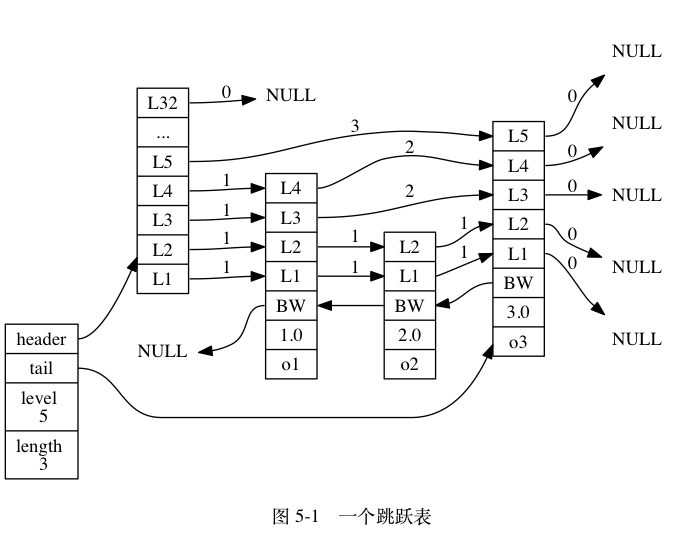
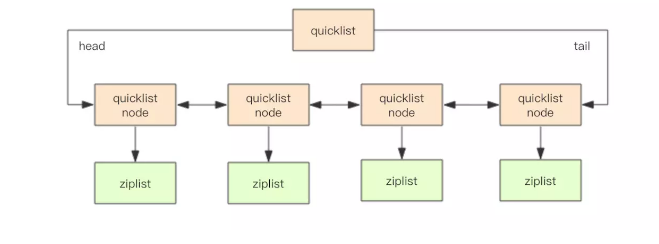

# 01 字符串 sdshdr

## 1.1 实现

简单动态字符串（simple dynamic string，SDS），适用于

* 保存数据库中的字符串值
* 缓冲区（buffer）：
  * AOF 模块中的 AOF 缓冲区
  * 客户端状态中的输入缓冲区

```c++
struct sdshdr {
    // 记录 buf 数组中已使用字节的数量
    // 等于 SDS 所保存字符串的长度
    int len;

    // 记录 buf 数组中未使用字节的数量
    int free;

    // 字节数组，用于保存字符串
    char buf[];
	// 而最后一个字节会保存空字符 '\0'
    // 遵循空字符结尾这一惯例的好处是， SDS 可以直接重用一部分 C 字符串函数库里面的函数。
};
```

## 1.2 SDS与C

区别：

* 获取一个 SDS **长度**的复杂度仅为$O(1)$ 
* 完全杜绝了发生缓冲区溢出（防止紧邻的**字符串修改时溢出**的问题）
  * API会自动解决空间检查和扩容的问题
* 通过未使用空间解除了字符串长度和底层数组长度之间的关联（**减少内存重分配**）
* API进行空间预分配的时候，会同时分配**必要的和未使用空间** 
  * `len`小于`1MB`时，`len`和`free`的分配值相同
  * `len`大于`1MB`时，`free`分配`1MB`相同
* 惰性空间释放，优化 SDS 的字符串缩短操作
* **二进制安全**，C 字符串中不能包含`'\0'`（会提前判定结束）

相同：

* 末尾`'\0'`可以重用库函数

# 02 链表 list

## 2.1 实现

链表节点是一个双端链表

```c++
typedef struct listNode {

    // 前置节点
    struct listNode *prev;

    // 后置节点
    struct listNode *next;

    // 节点的值
    void *value;

} listNode;
```

基于`listNode`的持有

```c++
typedef struct list {

    // 表头节点
    listNode *head;

    // 表尾节点
    listNode *tail;

    // 链表所包含的节点数量
    unsigned long len;

    // 节点值复制函数
    void *(*dup)(void *ptr);

    // 节点值释放函数
    void (*free)(void *ptr);

    // 节点值对比函数
    int (*match)(void *ptr, void *key);

} list;
```

一个 `list` 结构和三个 `listNode` 结构组成的链表：


链表实现的特性：

* 双端
* 无环
* 带表头和表尾
* 带链表长度
* 多态：链表节点`void *`类型，可以保存多种类型的数据

# 03 字典 dict

## 3.1 实现

Redis 的字典使用哈希表作为底层实现， 一个哈希表里面可以有多个哈希表节点， 而每个哈希表节点就保存了字典中的一个键值对。

### 哈希表

```c
typedef struct dictht {

    // 哈希表数组
    dictEntry **table;

    // 哈希表大小
    unsigned long size;

    // 哈希表大小掩码，用于计算索引值
    // 总是等于 size - 1
    unsigned long sizemask;

    // 该哈希表已有节点的数量
    unsigned long used;

} dictht;
```

### 哈希表节点

```c
typedef struct dictEntry {

    // 键
    void *key;

    // 值
    union {
        void *val;    // 指针
        uint64_t u64;
        int64_t s64;
    } v;

    // 指向下个哈希表节点，形成链表
    struct dictEntry *next;

} dictEntry;
```

### 字典

```c
typedef struct dict {

    // 类型特定函数
    dictType *type;

    // 私有数据 for 多态
    void *privdata;

    // 哈希表 和 rehash 有关
    dictht ht[2];

    // rehash 索引
    // 当 rehash 不在进行时，值为 -1
    int rehashidx; /* rehashing not in progress if rehashidx == -1 */

} dict;

typedef struct dictType {

    // 计算哈希值的函数
    unsigned int (*hashFunction)(const void *key);

    // 复制键的函数
    void *(*keyDup)(void *privdata, const void *key);

    // 复制值的函数
    void *(*valDup)(void *privdata, const void *obj);

    // 对比键的函数
    int (*keyCompare)(void *privdata, const void *key1, const void *key2);

    // 销毁键的函数
    void (*keyDestructor)(void *privdata, void *key);

    // 销毁值的函数
    void (*valDestructor)(void *privdata, void *obj);

} dictType;
```

### 图


## 3.2 哈希算法

当要将一个新的键值对添加到字典里面时， 程序需要先根据键值对的键计算出**哈希值**和**索引值**， 然后再根据索引值， 将包含新键值对的**哈希表节点**放到哈希表数组的指定索引上面。

计算工作：

```c
// 使用字典设置的哈希函数，计算键 key 的哈希值
hash = dict->type->hashFunction(key);

// 使用哈希表的 sizemask 属性和哈希值，计算出索引值
// 根据情况不同， ht[x] 可以是 ht[0] 或者 ht[1]
// sizemask = size - 1
index = hash & dict->ht[x].sizemask;
```

## 3.3 键冲突

索引相同时会发生冲突，Redis 的哈希表使用链地址法（separate chaining）来解决。

因为 `dictEntry` 节点组成的链表没有指向链表表尾的指针， 所以为了速度考虑， 程序总是将新节点添加到链表的表头位置（复杂度为$O(1)$)， 排在其他已有节点的前面。

## 3.4 Rehash

### rehash过程

为了让哈希表的负载因子（load factor）维持在一个合理的范围之内， 当哈希表**保存的键值对**数量太多或者太少时， 程序需要对哈希表的大小进行相应的扩展或者收缩。

步骤：

1. 在`h[1]`分配新的空间，
2. 将`h[0]`上的键值对rehash到`h[1]`上
3. `h[0]`置空，`h[1]`设置为`h[0]`，`h[1]`新创建空白hash表
4. 哈希表的负载因子小于 `0.1` 时，启动缩容

### 渐进式rehash

一次性rehash可能存在键值数量导致计算量太大的问题，所以需要**分多次、渐进式地**将 `ht[0]` 里面的键值对慢慢地 rehash 到 `ht[1]` 。

步骤：

1. `ht[1]` 分配空间， 让字典同时持有 `ht[0]` 和 `ht[1]` 两个哈希表
2. 在字典中维持一个索引计数器变量 `rehashidx` ， 并将它的值设置为 `0` ， 表示 rehash 工作正式开始
3.  rehash 进行期间， 每次对字典执行添加、删除、查找或者更新操作时， 程序除了执行指定的操作以外， 还会顺带**将 `ht[0]` 哈希表在 `rehashidx` 索引**上的所有键值对 rehash 到 `ht[1]` ， 当 rehash 工作完成之后， 程序将 `rehashidx` 属性的值增一
4. 随着字典操作的不断执行， 最终在某个时间点上， `ht[0]` 的所有键值对都会被 rehash 至 `ht[1]` ， 这时程序将 `rehashidx` 属性的值设为 `-1` ， 表示 rehash 操作已完成

查找过程时先从`h[0]`找，添加过程直接加到`h[1]`

# 04 跳表 zskiplist

## 4.1 实现



表示跳跃表节点

```c
typedef struct zskiplistNode {

    // 后退指针
    struct zskiplistNode *backward;

    // 分值 跳跃表中，节点按各自所保存的分值从小到大排列。
    double score;

    // 成员对象
    robj *obj;

    // 层
    struct zskiplistLevel {

        // 前进指针
        struct zskiplistNode *forward;

        // 跨度
        unsigned int span;

    } level[];

} zskiplistNode;
```

遍历操作只使用前进指针就可以完成了

跨度实际上是用来计算排位（rank）的： 在查找某个节点的过程中， 将沿途访问过的所有层的跨度累计起来， 得到的结果就是目标节点在跳跃表中的排位

保存跳跃表节点

```c++
typedef struct zskiplist {
    struct zskiplistNode *header, *tail;
    unsigned long length;
    int level;
} zskiplist;
```

# 05 整数集合 intset

## 5.1 实现

当一个集合只包含整数值元素， 并且这个集合的**元素数量不多**时， Redis 就会使用整数集合作为集合键的底层实现。可以保存类型为 `int16_t` 、 `int32_t` 或者 `int64_t` 的整数值， 并且保证集合中**不会出现重复元素**。

```c
typedef struct intset {

    // 编码方式
    uint32_t encoding;

    // 集合包含的元素数量
    uint32_t length;

    // 保存元素的数组
    int8_t contents[];

} intset;
```

可以保存类型为 `int16_t` 、 `int32_t` 或者 `int64_t` 的整数值

`contents` 数组是整数集合的底层实现： 整数集合的每个元素都是 `contents` 数组的一个数组项（item）， 各个项在数组中按值的大小**从小到大**有序地排列， 并且数组中不包含任何重复项。

虽然 `intset` 结构将 `contents` 属性声明为 `int8_t` 类型的数组， 但实际上 `contents` 数组并不保存任何 `int8_t` 类型的值 —— `contents` 数组的**真正类型取决**于 `encoding` 属性的值：

示例：


## 5.2 升级

每当我们要将一个新元素添加到整数集合里面， 并且新元素的**类型**比整数集合现有所有元素的类型都要长时， 整数集合需要先进行升级（upgrade）， 然后才能将新元素添加到整数集合里面。

升级整数集合并添加新元素共分为三步进行：

1. 根据新元素的类型， 扩展整数**集合底层数组的空间大小**， 并为新元素分配空间。
2. 将底层数组现有的所有元素都转换成与**新元素相同**的类型， 并将类型转换后的元素放置到正确的位上， 而且在放置元素的过程中， 需要继续维持底层数组的**有序性质**不变。
3. 将新元素添加到底层数组里面，改变整数集合 `encoding` 属性的值。

添加元素的时候：

- 在新元素小于所有现有元素的情况下， 新元素会被放置在底层数组的最开头（索引 `0` ）；
- 在新元素大于所有现有元素的情况下， 新元素会被放置在底层数组的最末尾（索引 `length-1` ）。

**升级的好处：**

* 灵活
* 节约内存

**不支持降级**

# 06 压缩列表

## 6.1 实现

**列表**

当一个列表键只包含少量列表项， 并且每个列表项要么就是小整数值， 要么就是长度比较短的字符串， 那么 Redis 就会使用压缩列表来做列表键的底层实现。

连续，无序的数据结构。压缩列表是 Redis 为了节约内存而开发的， 由一系列**特殊编码的连续内存块**组成的**顺序型（sequential）数据结构**。


**列表节点**

每个压缩列表节点都由 `previous_entry_length` 、 `encoding` 、 `content` 三个部分组成

* `previous_entry_length`以字节为单位， 记录了压缩列表中前一个节点的长度
  * 如果前一节点的长度小于 `254` 字节，那么 `previous_entry_length` 属性的长度为 `1` 字节
  * 如果前一节点的长度大于等于 `254` 字节， 那么 `previous_entry_length` 属性的长度为 `5` 字节
* `encoding`属性记录了节点的`content`属性所保存数据的类型以及长度
* 节点的 `content` 属性负责保存节点的值， 节点值可以是一个**字节数组或者整数**， 值的类型和长度由节点的 `encoding` 属性决定

## 6.2 连锁更新

考虑这样一种情况： 在一个压缩列表中， 有多个连续的、长度介于 `250` 字节到 `253` 字节之间的节点 `e1` 至 `eN` ，因为 `e1` 至 `eN` 的所有节点的长度都小于 `254` 字节， 所以记录这些节点的长度只需要 `1` 字节长的 `previous_entry_length` 属性， 换句话说，`e1` 至 `eN` 的所有节点的 `previous_entry_length` 属性都是 `1` 字节长的。


如果我们将一个长度大于等于 `254` 字节的新节点 `new` 设置为压缩列表的表头节点， 那么 `new` 将成为 `e1` 的前置节点，


因为 `e1` 的 `previous_entry_length` 属性仅长 `1` 字节， 它没办法保存新节点 `new` 的长度， 所以程序将对压缩列表执行空间重分配操作， 并将`e1` 节点的 `previous_entry_length` 属性从原来的 `1` 字节长扩展为 `5` 字节长。**引起了`e2`的空间重分配，然后一直传递下去**

要注意的是， 尽管连锁更新的复杂度较高， 但它真正造成性能问题的几率是很低的：

* 不容易出现上述情况
* 即使出现，节点数量也不多

# 07 对象

Redis 使用对象来表示数据库中的键和值， 每次当我们在 Redis 的数据库中新创建一个键值对时， 我们至少会创建两个对象， 一个对象用作键值对的键（键对象）， 另一个对象用作键值对的值（值对象）。

Redis 中的每个对象都由一个 `redisObject` 结构表示， 该结构中和保存数据有关的三个属性分别是 `type` 属性、 `encoding` 属性和 `ptr` 属性：

```c
typedef struct redisObject {

    // 类型
    unsigned type:4;

    // 编码
    unsigned encoding:4;

    // 指向底层实现数据结构的指针
    void *ptr;

    // ...

} robj;
```

对于 Redis 数据库保存的键值对来说， 键总是**一个字符串对象**， 而值则可以是**字符串对象**、**列表对象**、**哈希对象**、**集合对象**或者**有序集合对象**的其中一种， 因此：

- 当我们称呼一个数据库键为“字符串键”时， 我们指的是“这个数据库键所对应的值为字符串对象”；
- 当我们称呼一个键为“列表键”时， 我们指的是“这个数据库键所对应的值为列表对象”。

**实现**

对象的 `ptr` 指针指向对象的底层实现数据结构， 而这些数据结构由对象的 `encoding` 属性决定。

| 编码常量                    | 编码所对应的底层数据结构      |
| --------------------------- | ----------------------------- |
| `REDIS_ENCODING_INT`        | `long` 类型的整数             |
| `REDIS_ENCODING_EMBSTR`     | `embstr` 编码的简单动态字符串 |
| `REDIS_ENCODING_RAW`        | 简单动态字符串                |
| `REDIS_ENCODING_HT`         | 字典                          |
| `REDIS_ENCODING_LINKEDLIST` | 双端链表                      |
| `REDIS_ENCODING_ZIPLIST`    | 压缩列表                      |
| `REDIS_ENCODING_INTSET`     | 整数集合                      |
| `REDIS_ENCODING_SKIPLIST`   | 跳跃表和字典                  |

每种类型的**对象都至少**使用了两种不同的编码：

| 类型           | 编码                        | 对象                                                 |
| -------------- | --------------------------- | ---------------------------------------------------- |
| `REDIS_STRING` | `REDIS_ENCODING_INT`        | 使用整数值实现的字符串对象。                         |
| `REDIS_STRING` | `REDIS_ENCODING_EMBSTR`     | 使用 `embstr` 编码的简单动态字符串实现的字符串对象。 |
| `REDIS_STRING` | `REDIS_ENCODING_RAW`        | 使用简单动态字符串实现的字符串对象。                 |
| `REDIS_LIST`   | `REDIS_ENCODING_ZIPLIST`    | 使用压缩列表实现的列表对象。                         |
| `REDIS_LIST`   | `REDIS_ENCODING_LINKEDLIST` | 使用双端链表实现的列表对象。                         |
| `REDIS_HASH`   | `REDIS_ENCODING_ZIPLIST`    | 使用压缩列表实现的哈希对象。                         |
| `REDIS_HASH`   | `REDIS_ENCODING_HT`         | 使用字典实现的哈希对象。                             |
| `REDIS_SET`    | `REDIS_ENCODING_INTSET`     | 使用整数集合实现的集合对象。                         |
| `REDIS_SET`    | `REDIS_ENCODING_HT`         | 使用字典实现的集合对象。                             |
| `REDIS_ZSET`   | `REDIS_ENCODING_ZIPLIST`    | 使用压缩列表实现的有序集合对象。                     |
| `REDIS_ZSET`   | `REDIS_ENCODING_SKIPLIST`   | 使用跳跃表和字典实现的有序集合对象。                 |

通过 `encoding` 属性来设定对象所使用的编码， 而不是为特定类型的对象关联一种固定的编码， 极大地提升了 Redis 的灵活性和效率， 因为 Redis 可以根据不同的使用场景来为一个对象设置不同的编码， 从而优化对象在某一场景下的效率。

## 7.1 字符串对象

字符串对象的编码可以是 `int` 、 `raw` 或者 `embstr`

**int**

如果一个字符串对象保存的是整数值， 并且这个整数值可以用 `long` 类型来表示， 那么字符串对象会将整数值保存在字符串对象结构的 `ptr`属性里面（将 `void*` 转换成 `long` ）， 并将字符串对象的编码设置为 `int` 。

**embstr**

如果字符串对象保存的是一个字符串值， 并且这个字符串值的长度小于等于 `39` 字节， 那么字符串对象将使用 `embstr` 编码的方式来保存这个字符串值。

**raw**

如果字符串对象保存的是一个字符串值， 并且这个字符串值的长度大于 `39` 字节(实际使用的时候并不一定时39)， 那么字符串对象将使用一个简单动态字符串（SDS）来保存这个字符串值， 并将对象的编码设置为 `raw` 。

**浮点数**

`long double` 类型表示的浮点数在 Redis 中也是作为字符串值来保存的。

**编码转换**

对于 `int` 编码的字符串对象来说， 如果我们向对象执行了一些命令， 使得这个对象保存的不再是整数值， 而是一个字符串值， 那么字符串对象的编码将从 `int` 变为 `raw` 。（ `embstr` 编码的字符串对象实际上是只读，不支持转换为`embstr`）

## 7.2 列表对象

列表对象的编码可以是 `ziplist` 或者 `linkedlist`

**ziplist**

`ziplist` 编码的列表对象使用压缩列表作为底层实现， 每个**压缩列表**节点（entry）保存了一个列表元素。

**linkedlist**

`linkedlist` 编码的列表对象使用**双端链表**作为底层实现， 每个双端链表节点（node）都保存了一个字符串对象， 而每个字符串对象都保存了一个列表元素。

**quickList**

考虑到链表的附加空间相对太高，prev 和 next 指针就要占去 16 个字节 (64bit 系统的指针是 8 个字节)，另外每个节点的内存都是单独分配，会加剧内存的碎片化，影响内存管理效率。

后续版本对列表数据结构进行了改造，使用 quicklist 代替了 ziplist 和 linkedlist。

`quickList` 是 zipList 和 linkedList 的混合体，它将 linkedList 按段切分，每一段使用 zipList 来紧凑存储，多个 zipList 之间使用双向指针串接起来。



## 7.3 哈希对象

哈希对象的编码可以是 `ziplist` 或者 `hashtable` 。

`ziplist` 编码的哈希对象使用压缩列表作为底层实现， 每当有新的键值对要加入到哈希对象时， 程序会先将保存了键的压缩列表节点推入到压缩列表表尾， 然后再将保存了值的压缩列表节点推入到压缩列表表尾。


另一方面， `hashtable` 编码的哈希对象使用字典作为底层实现， 哈希对象中的每个键值对都使用一个字典键值对来保存：

- 字典的每个键都是一个字符串对象， 对象中保存了键值对的键；
- 字典的每个值都是一个字符串对象， 对象中保存了键值对的值


## 7.4 集合

集合对象的编码可以是 `intset` 或者 `hashtable` 。

`intset` 编码的集合对象使用整数集合作为底层实现， 集合对象包含的所有元素都被保存在整数集合里面。


另一方面， `hashtable` 编码的集合对象使用字典作为底层实现， 字典的每个键都是一个字符串对象， 每个字符串对象包含了一个集合元素， 而字典的值则全部被设置为 `NULL` 


## 7.5 有序集合

有序集合的编码可以是 `ziplist` 或者 `skiplist`

`ziplist` 编码的有序集合对象使用压缩列表作为底层实现， 每个集合元素使用两个紧挨在一起的压缩列表节点来保存， 第一个节点保存元素的成员（member）， 而第二个元素则保存元素的分值（score）。

`skiplist` 编码的有序集合对象使用 `zset` 结构作为底层实现， 一个 `zset` 结构同时包含一个字典和一个跳跃表：

```c
typedef struct zset {

    zskiplist *zsl;

    dict *dict;

} zset;
```

`zset` 结构中的 `zsl` 跳跃表按分值从小到大保存了所有集合元素， 每个跳跃表节点都保存了一个集合元素： 跳跃表节点的 `object` 属性保存了元素的成员， 而跳跃表节点的 `score` 属性则保存了元素的分值。

除此之外， `zset` 结构中的 `dict` 字典为有序集合创建了一个从成员到分值的映射， 字典中的每个键值对都保存了一个集合元素： 字典的键保存了元素的成员， 而字典的值则保存了元素的分值。 