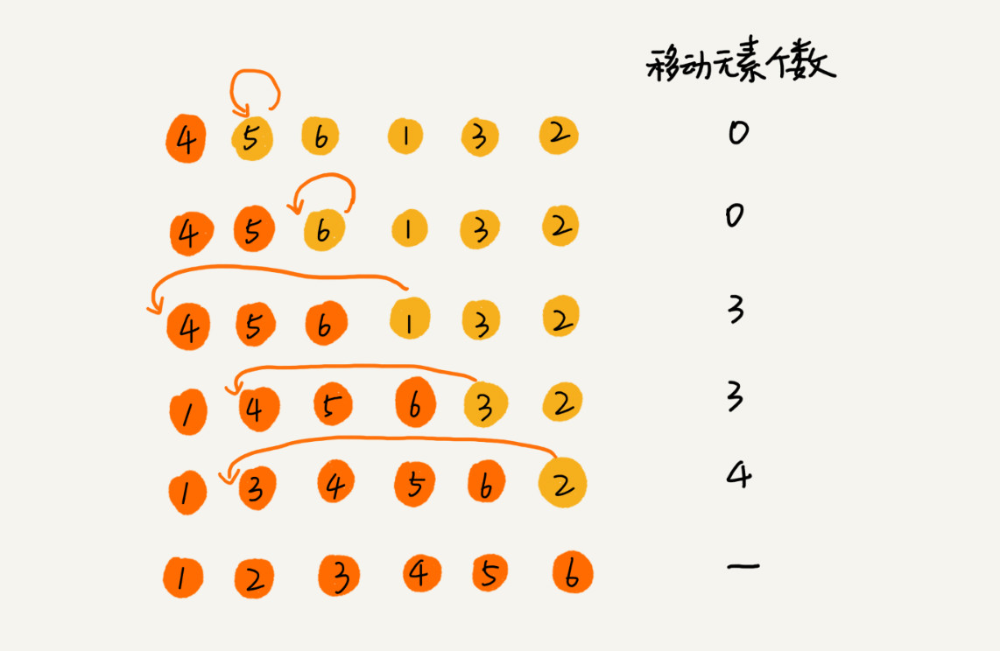

# 排序总结

冒泡排序、插入排序、选择排序、归并排序、快速排序、计数排序、基数排序、桶排序。

|   类别   |   方法   |    复杂度    |     最好     |     最坏     |  空间  | 稳定性 |
| :------: | :------: | :----------: | :----------: | :----------: | :----: | :----: |
| 插入排序 | 插入排序 |   $O(n^2)$   |    $O(n)$    |   $O(n^2)$   | $O(1)$ |  稳定  |
|          | 希尔排序 | $O(n^{1.3})$ |    $O(n)$    |   $O(n^2)$   | $O(1)$ | 不稳定 |
| 选择排序 | 选择排序 |   $O(n^2)$   |   $O(n^2)$   |   $O(n^2)$   | $O(1)$ | 不稳定 |
|          |  堆排序  | $O(nlog_2n)$ | $O(nlog_2n)$ | $O(nlog_2n)$ | $O(1)$ | 不稳定 |
| 交换排序 | 冒泡排序 |   $O(n^2)$   |    $O(n)$    |   $O(n^2)$   | $O(1)$ |  稳定  |
|          | 快速排序 | $O(nlog_2n)$ | $O(nlog_2n)$ |   $O(n^2)$   | $O(1)$ | 不稳定 |
| 归并排序 |          | $O(nlog_2n)$ | $O(nlog_2n)$ | $O(nlog_2n)$ | $O(n)$ |  稳定  |

## 原地排序

原地排序算法，就是特指**空间复杂度是$O(1)$的**排序算法

## 稳定性  

这个概念是说，如果待排序的序列中存在值相等的元素，经过排序之后，相等元素之间原有的**先后顺序不变**。

## 冒泡排序、插入排序、选择排序

### 冒泡排序

冒泡排序只会操作相邻的两个数据。每次冒泡操作都会对相邻的两个元素进行比较，看是否满足大小关系要求。如果不满足就让它俩互换。

**原地：**不涉及辅助空间$O(1)$

**稳定：**相同元素不必交换

**复杂度：**

* 最好情况（已经有序），需要一次遍历$O(n)$
* 最坏情况，需要n次遍历，$O(n^2)$


### 插入排序

数组中的数据分为两个区间，**已排序区间和未排序区间**。是取未排序区间中的元素，在已排序区间中找到合适的插入位置将其插入，并保证已排序区间数据一直有序。

插入排序也包含两种操作，一种是**元素的比较**，一种是**元素的移动**。

**原地：**不涉及辅助空间$O(1)$

**稳定：**相同元素可以指定顺序，后面出现的放在后面

**复杂度：**

* 最好情况（已经有序），需要一次遍历$O(n)$
* 最坏情况，需要n次遍历，$O(n^2)$



### 选择排序

选择排序算法的实现思路有点类似插入排序，也分已排序区间和未排序区间。**但是选择排序每次会从未排序区间中找到最小的元素**，将其放到已排序区间的末尾。

**原地：**不涉及辅助空间$O(1)$

**稳定：**选择排序每次都要找剩余未排序元素中的最小值，并和前面的元素**交换位置**，这样破坏了稳定性。

**复杂度：**

* 每次都要选，所以是$O(n^2)$


冒泡排序、插入排序、选择排序这三种排序算法，它们的时间复杂度都是 O(n2)，比较高，适合小规模数据的排序。

## 归并和快排

这两种排序算法适合大规模的数据排序，归并排序和快速排序都用到了**分治思想**。

### 归并排序

归并排序的核心思想还是蛮简单的。如果要排序一个数组，我们先把数组从中间分成前后两部分，然后对前后两部分分别排序，再将排好序的两部分合并在一起，这样整个数组就都有序了。

**原地：**合并的过程中需要**辅助数组**，这样就不是原地的。复杂度$O(n)$

**稳定：**在**合并**的过程中，可以保留元素的顺序

**复杂度：**

* 归并排序是先分解的，无论有序还是无序，都是$O(nlog_2n)$


```java
public class MergeSort {
    public void mergeSort(int[] nums) {
        int len = nums.length;

        mergeSortInner(nums, 0, len - 1);
    }

    private void mergeSortInner(int[] nums, int left, int right) {
        if (left >= right) return;

        int mid = left + (right - left) / 2;

        mergeSortInner(nums, left, mid);
        mergeSortInner(nums, mid + 1, right);

        // 合并
        merge(nums, left, mid, right);
    }

    private void merge(int[] nums, int left, int mid, int right) {
        int i = left;
        int j = mid + 1;
        int k = 0;
        int[] temp = new int[right - left + 1];

        while (i <= mid && j <= right) {
            if (nums[i] <= nums[j]) {
                temp[k++] = nums[i++];
            } else {
                temp[k++] = nums[j++];
            }
        }

        // 剩余数据拷贝
        int start = i;
        int end = mid;
        if (j <= right) {
            start = j;
            end = right;
        }

        while (start <= end) {
            temp[k++] = nums[start++];
        }

        // tmp中的数组拷贝回去
        for (i = 0; i < right - left; i++) {
            nums[left+i] = temp[i];
        }
    }
}
```

### 快速排序

如果要排序数组中下标从 p 到 r 之间的一组数据，我们选择 p 到 r 之间的任意一个数据作为 **pivot（分区点）**。

我们遍历 p 到 r 之间的数据，将小于 pivot 的放到左边，将大于 pivot 的放到右边，将 pivot 放到中间。（使用数组的交换，减少复杂度）

然后递归的处理左右两个区间的数。

**原地：**不涉及辅助空间$O(1)$

**稳定：**分区涉及到**交换**的操作，两个相同元素的位置可能会改变

**复杂度：**

* 最好情况（已经有序），$O(nlogn)$需要一次遍历$O(n)$

* 最坏情况，包括已经排好序和没有排好序的情况，都一样的

  需要n次遍历，$O(n^2)$


```java
public class QuickSort {
    public static void QuickSort(int[] nums, int size) {
        QuickSortInner(nums, 0, size - 1);
    }

    public static void QuickSortInner(int[] nums, int start, int end) {
        if (start >= end) return;

        int pivot = partition(nums, start, end);
        QuickSortInner(nums, start, pivot - 1);
        QuickSortInner(nums, pivot + 1, end);
    }

    public static int partition(int[] nums, int start, int end) {
        int pivot = nums[end];
        int i = start;
        for (int j = start; j < end; j++) {
            if (nums[j] < pivot) {
                if (i == j) {
                    ++i;
                } else {
                    int tmp = nums[i];
                    nums[i++] = nums[j];
                    nums[j] = tmp;
                }
            }
        }

        nums[end] = nums[i];
        nums[i] = pivot;

        return i;
    }
}
```


