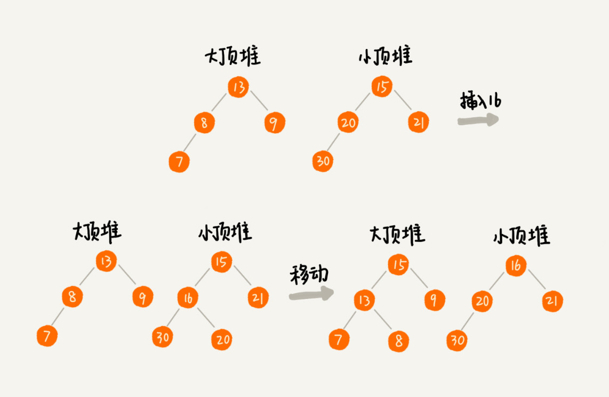

# 堆

## 定义

* 堆是一个完全二叉树
* 堆中每一个节点的值都必须大于等于（或小于等于）其子树中每个节点的值

完全二叉树比较适合用数组来存储，数组中下标为 i 的节点的左子节点，就是下标为 i∗2 的节点，右子节点就是下标为 i∗2+1 的节点，父节点就是下标为 i/2 的节点。

## 堆化

### 添加

自下而上，依次比对节点、父节点，不停的交换

### 删除堆顶

把数组最后一个元素放在堆顶的位置，然后再堆化，防止出现数组空洞。

# 堆排序

## 1. 建堆

原地建堆有两种思路：

* 堆化：不停的插入数据，从下往上堆化
* 反堆化：从第一个非叶子节点开始，自上而下堆化

## 2. 排序

不停的取出堆顶元素，堆化剩下的数据，直到取出完毕

$O(nlogn)$

# 应用

## 优先级队列

一个堆就可以看作一个**优先级队列**。很多时候，它们只是概念上的区分而已。往优先级队列中插入一个元素，就相当于往堆中插入一个元素；从优先级队列中取出优先级最高的元素，就相当于取出堆顶元素。

### 1. 合并有序小文件

假设我们有 100 个小文件，每个文件的大小是 100MB，每个文件中存储的都是有序的字符串。我们希望将这些 100 个小文件合并成一个有序的大文件。这里就会用到优先级队列。

我们将从小文件中取出来的字符串放入到小顶堆中，那堆顶的元素，也就是优先级队列队首的元素，就是最小的字符串。我们将这个字符串放入到大文件中，并将其从堆中删除。然后再从小文件中取出下一个字符串，放入到堆中。循环这个过程，就可以将 100 个小文件中的数据依次放入到大文件中

## Top K

构建小顶堆，比堆顶元素大的需要入堆，堆化的时间复杂度是$O(logK)$，遍历的时间复杂度$O(n)$，于是总体的时间复杂度是$O(nlogK)$。

## 中位数

