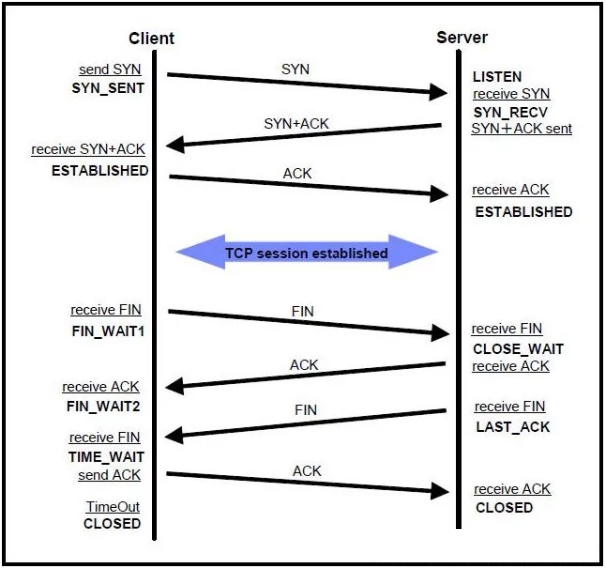
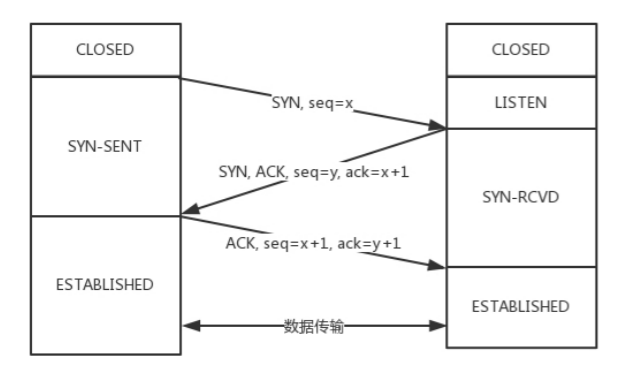
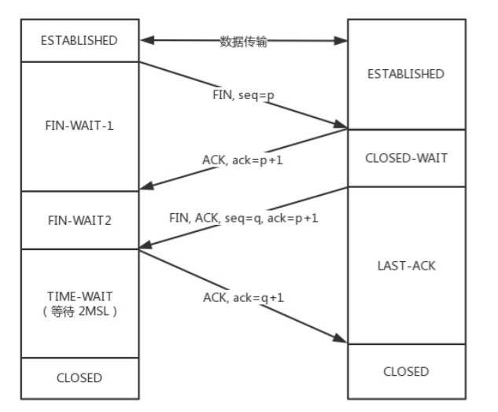
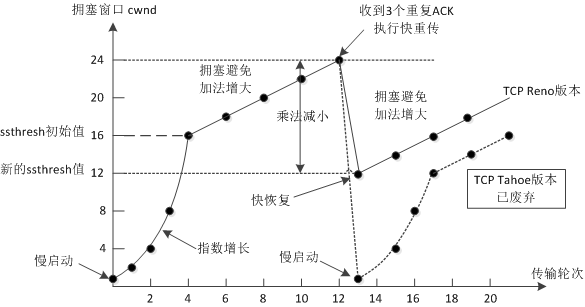
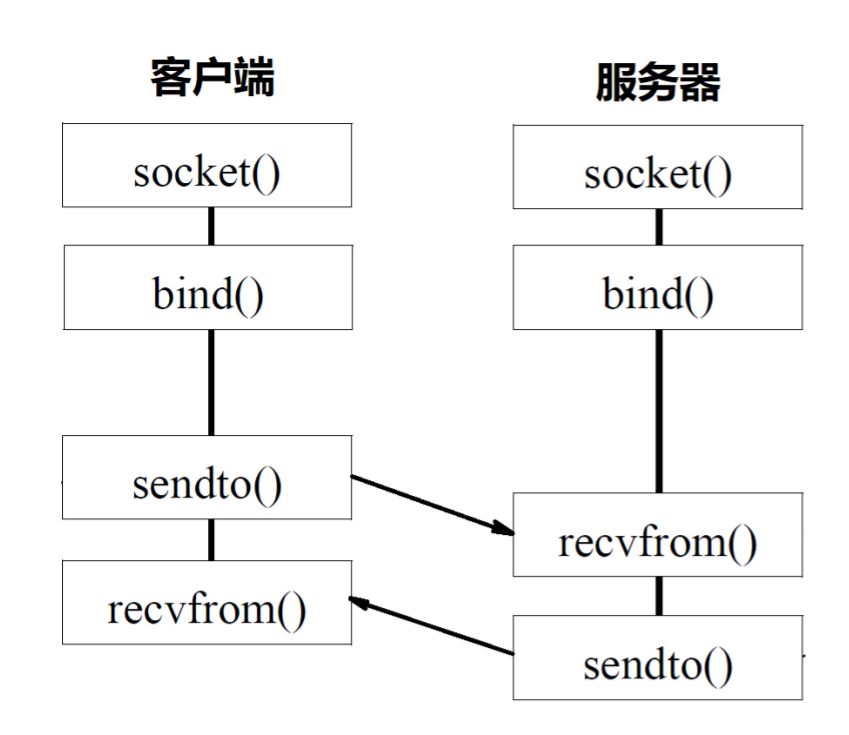

# TCP

## 1. 三次握手

1. 首先客户端向服务器端发送一段TCP报文，包括**SYN包和序列号**，进入**SYN_SENT**
2. 服务器端接收到来自客户端的TCP报文之后，结束**LISTEN**阶段，应答**SYN和ACK**，确认序列号，发送自己的序列号，进入**SYN-RCVD**
3. 客户端接收到来自服务器端的确认收到数据的TCP报文之后，明确了从客户端到服务器的数据传输是正常的，进入**ESTABLISHED**，向服务端发送**ACK+1**，结束**SYN-SENT**阶段，进入**ESTABLISHED**。

### 1.1 为什么不能是两次

这主要是为了防止已失效的请求连接报文忽然又传送到了，从而产生错误。

A要发起一个连接，当发了第一个请求杳无音信的时候，会有很多的可能性，比如第一个请求包丢了，再如没有丢，但是绕了弯路，超时了，还有B没有响应，不想和我连接。

### 1.2 三次握手的目的

建立通信连接

确认TCP包的序号 

## 2. 四次挥手

1. 首先客户端想要释放连接，向服务器端发送一段TCP报文，进入**FIN_WAIT_1**
2. 服务器端接收到从客户端发出的TCP报文之后，确认了客户端想要释放连接，进入**CLOSED_WAIT**，客户端进入**FIN_WAIT_2**
3. 服务器端自从发出ACK确认报文之后，经过CLOSED-WAIT阶段，做好了释放服务器端到客户端方向上的连接准备，再次向客户端发出一段TCP报文，进入**LAST_ACK**
4. 客户端收到从服务器端发出的TCP报文，确认了服务器端已做好释放连接的准备，结束**FIN-WAIT-2**阶段，进入**TIME-WAIT**阶段

### 2.1 状态

* FIN_WAIT_1：发送了第一次的FIN
* FIN_WAIT_2：表示处于半连接的状态
* CLOSE_WAIT：进入等待关闭状态，检查是否还有数据需要发送
* LAST_ACK：被动关闭的一方等待确认的ACK报文
* TIME_WAIT：等待的时间设为2MSL，MSL是Maximum Segment Lifetime，**报文最大生存时间**，它是任何报文在 网络上存在的最长时间。两个周期表示双向的报文都可以消失。

### 2.2 TIME_WAIT

只有发起**终止连接**的一方会进入TIME_WAIT状态，如果在 TIME_WAIT 时间内，因为**客户端**的 ACK 没有传输到主机 2，**客户端**又接收到了**服务端**重发的 FIN 报文，那么 2MSL 时间将重新计时。道理很简单，因为 2MSL 的时间，目的是为了让旧连接的所有报文都能自然消亡，现在**客户端**重新发送了 ACK 报文，自然需要重新计时，以便防止这个 ACK 报文对新可能的连接化身造成干扰。

在高并发短连接的TCP服务器上，当服务器处理完请求后立刻主动正常关闭连接。这个场景下会出现大量socket处于TIME_WAIT状态。如果客户端的并发量持续很高，此时部分客户端就会显示连接不上。主动正常关闭TCP连接，都会出现TIMEWAIT。

为什么我们要关注这个高并发短连接呢？有两个方面需要注意：

1. **高并发**可以让服务器在短时间范围内同时占用大量端口，而端口有个0~65535的范围，并不是很多，刨除系统和其他服务要用的，剩下的就更少了。
2. 在这个场景中，**短连接**表示“业务处理+传输数据的时间 远远小于**TIME_WAIT**超时的时间”的连接。

解决：**扩大容量，减少短链接，减短TIME_WAIT时间**

### 2.3 为什么要四次

是一个双向的连接，需要分别关闭。

## 3. 连续ARQ协议

在TCP里，接收端会给发送端报一个**窗口的大小**

发送窗口和接收窗口是 TCP 连接的双方，一个作为生产者，一个作为消费者，为了达到一致协同的生产 - 消费速率、而产生的算法模型实现。

区别于停止等待ARQ：每发送一个数据包，就暂停等待确认，**超时没有收到确认信息则表明传输失败**，缺点是信道利用率太低。

连续：

* 发送方维护一个滑动窗口，位于窗口内的分组都可以连续的发送出去，不用等待对方确认，然后，每收到窗口内第一个分组的确认，就向前移动。
* 接收方采用累计确认的方式，对**按序到达**的最后一个分组发送累积确认

## 4. 拥塞控制

在 TCP 协议中，拥塞控制是通过拥塞窗口来完成的，拥塞窗口的大小会随着网络状况实时调整。

* TCP流量控制

  防止过多的数据注入到网络中导致过载，流量控制所要做的就是控制发送端发送速率：发送的发送窗口不可以大于接收方的接收窗口大小。

* TCP拥塞控制

  **慢开始，拥塞避免，快重传，快恢复**

  

在任何一个时刻，TCP 发送缓冲区的数据是否能真正发送出去，**至少**取决于两个因素，一个是**当前的发送窗口大小**，另一个是**拥塞窗口大小**，而 TCP 协议中总是取两者中最小值作为判断依据。

## 5 TCP长连接

保持对连接有效性的检测，是我们在实战中必须要注意的一个点。在没有数据读写的“静默”的连接上，是没有办法发现 TCP 连接是有效还是无效的。比如客户端突然崩溃，服务器端可能在几天内都维护着一个无用的 TCP 连接。

### 5.1 Keep-Alive

定义一个时间段，在这个时间段内，如果没有任何连接相关的活动，TCP 保活机制会开始作用，每隔一个时间间隔，发送一个探测报文，该探测报文包含的数据非常少：

* **对端程序是正常工作**，这样 TCP 保活时间会被重置，等待下一个 TCP 保活时间的到来。
* **对端程序崩溃并重启**，会产生一个 RST 报文，这样很快就会发现 TCP 连接已经被重置。
* **对端程序崩溃**，连续几次，达到保活探测次数后，TCP 会报告该 TCP 连接已经死亡。

时延较长，不满足要求

### 5.2 应用层

应用程序中模拟 TCP Keep-Alive 机制，来完成在应用层的连接探活。

## 6 小数据

小数据包加剧了网络带宽的浪费，为了解决这个问题，引入了如 Nagle 算法、延时 ACK 等机制。

Nagle 算法的本质其实就是限制大批量的小数据包同时发送，为此，它提出，在任何一个时刻，未被确认的小数据包不能超过一个。

延时 ACK 在收到数据后并不马上回复，而是累计需要发送的 ACK 报文，等到有数据需要发送给对端时，将累计的 ACK**捎带一并发送出去**。

## 7 流式协议

发送端，当我们调用 send 函数完成数据“发送”以后，数据并没有被真正从网络上发送出去，只是从应用程序拷贝到了**操作系统内核协议栈**中，至于什么时候真正被发送，取决于**发送窗口**、**拥塞窗口**以及当前**发送缓冲区**的大小等条件。

也就是说，我们**不能假设**每次 send 调用发送的数据，都会作为一个整体完整地被发送出去。

关于接收端字节流，有两点需要注意：

第一，先调用 send 函数发送的字节，总在后调用 send 函数发送字节的前面，这个是由 TCP 严格保证的；

第二，如果发送过程中有 TCP 分组丢失，但是其后续分组陆续到达，那么 TCP 协议栈会缓存后续分组，直到前面丢失的分组到达，最终，形成可以被应用程序读取的数据流。

## 8 网络字节排序

大端字节序：字节的高位在内存地址上靠前

小端字节序：字节的低位在内存地址上靠后

---

# UDP

UDP是一种面向数据报的协议，面向无连接，不保证报文的有效传递，有序等等。

TCP 的发送和接收每次都是在一个上下文中，类似这样的过程：

A 连接上: 接收→发送→接收→发送→…

B 连接上: 接收→发送→接收→发送→ …

而 UDP 的每次接收和发送都是一个独立的上下文，类似这样：

接收 A→发送 A→接收 B→发送 B →接收 C→发送 C→ …

- UDP 是无连接的数据报程序，和 TCP 不同，不需要三次握手建立一条连接。
- UDP 程序通过 recvfrom 和 sendto 函数直接收发数据报报文，recvfrom在收到消息前会一直处于阻塞状态中

## 为什么UDP是不可靠的

1. 没有数据备份
2. 只有头部加入了复用和数据校验
3. 发送端生产数据，接收端从网络中抓取数据

UDP的优点在于，可以广播数据。

UDP的用途：

- **DNS，TFP，SNMP**
- 视频、音频、普通数据

UDP最大包长度：

16位->2字节 存储长度信息，2^16-1=65535

头部64位=8字节，65536-8=65507，需要分包

