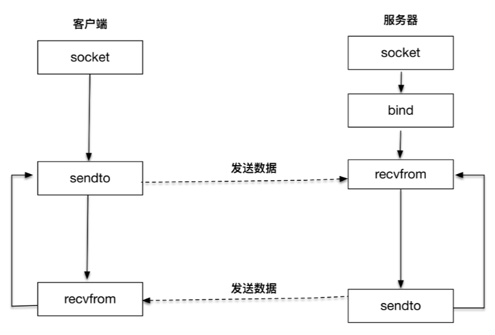

# 套接字

## 1. 套接字的地址结构

### 1.1 通用的地址结构：

```c
/* POSIX.1g 规范规定了地址族为 2 字节的值.  */
typedef unsigned short int sa_family_t;
/* 描述通用套接字地址  */
struct sockaddr{
    sa_family_t sa_family;  /* 地址族.  16-bit*/
    char sa_data[14];   /* 具体的地址值 112-bit */
  }; 
```

地址族表示使用什么样的方式保存地址：

- AF_LOCAL：表示的是本地地址，对应的是 Unix 套接字，这种情况一般用于本地 socket 通信，很多情况下也可以写成 AF_UNIX、AF_FILE；
- AF_INET：因特网使用的 IPv4 地址；
- AF_INET6：因特网使用的 IPv6 地址。

`sockaddr`是一个通用的地址结构，通用的意思是适用于多种地址族。

### 1.2 IPV4套接字

```c
/* IPV4 套接字地址，32bit 值.  */
typedef uint32_t in_addr_t;
struct in_addr
  {
    in_addr_t s_addr;
  };
  
/* 描述 IPV4 的套接字地址格式  */
struct sockaddr_in
  {
    sa_family_t sin_family;     /* 16-bit */
    in_port_t sin_port;         /* 端口号  16-bit*/
    struct in_addr sin_addr;    /* Internet address. 32-bit */
 
 
    /* 这里仅仅用作占位符，不做实际用处  */
    unsigned char sin_zero[8];
  };
```

sin_family字段

port最大支持 2 的 16 次方，这个数字是 65536，端口号0~65535

### 1.3 IPV6套接字

```c
struct sockaddr_in6
  {
    sa_family_t sin6_family; 	/* 16-bit */
    in_port_t sin6_port;  		/* 传输端口号 # 16-bit */
    uint32_t sin6_flowinfo; 	/* IPv6 流控信息 32-bit*/
    struct in6_addr sin6_addr;  /* IPv6 地址 128-bit */
    uint32_t sin6_scope_id; 	/* IPv6 域 ID 32-bit */
  };
```

### 1.4 本地套接字

```c
struct sockaddr_un {
    unsigned short sun_family; 	/* 固定为 AF_LOCAL */
    char sun_path[108];			/* 路径名 最多108字节*/
};
```

## 2. 套接字建立连接

### 2.1 创建套接字

```c
int socket(int domain, int type, int protocol)
```

domain表示使用**什么样**的套接字

type：

- SOCK_STREAM: 表示的是字节流，对应 TCP；
- SOCK_DGRAM： 表示的是数据报，对应 UDP；
- SOCK_RAW: 表示的是原始套接字。

~~protocol~~ 已经废弃，目前一般写成 0 

### 2.2 bind

```c
int bind(int fd, sockaddr * addr, socklen_t len);
```

bind 函数会根据 len 字段判断传入的参数 addr 该怎么**解析**（套接字的具体类型），len 字段表示的就是传入的地址长度，它是一个可变值。

```c
// 可以理解为通用类型
int bind(int fd, void * addr, socklen_t len);
```

fd表示使用的套接字

### 2.3 地址族

对于使用者来说，每次需要将 IPv4、IPv6 或者本地套接字格式转化为通用套接字格式：

```c
struct sockaddr_in name;
bind(sock, (struct sockaddr *) &name, sizeof(name))
```

使用通配设置套接字的地址

```c
struct sockaddr_in name;
name.sin_addr.s_addr = htonl (INADDR_ANY); /* IPV4 通配地址 */
```

指定端口和地址族

```c
name.sin_family = AF_INET; /* IPV4 */
name.sin_port = htons (port);
```

### 2.4 listen

```c
int listen (int socketfd, int backlog)
```

套接字+队列长度

### 2.5 accept

```c
int accept(int listensockfd, struct sockaddr *cliaddr, socklen_t *addrlen)
```

参数：listensockfd：**监听套接字**

返回：

- cliaddr：客户端地址

- addrlen：地址的大小
- socket's descriptor：**已连接套接字描述符**

监听套接字一直都存在，它是要为成千上万的客户来服务的，直到这个监听套接字关闭；而一旦一个客户和服务器连接成功，完成了 TCP 三次握手，操作系统内核就为这个客户生成一个已连接套接字，让应用服务器使用这个**已连接套接字**和客户进行通信处理。

### 2.6 connect

客户在调用函数 connect 前不必非得调用 bind 函数

```c
int connect(int sockfd, const struct sockaddr *servaddr, socklen_t addrlen)
```

如果是 TCP 套接字，那么调用 connect 函数将激发 TCP 的三次握手过程，而且仅在连接建立成功或出错时才返回。其中出错返回可能有以下几种情况：

- 无法建立握手，于是返回 TIMEOUT 错误。
- 客户端收到了 RST（复位）回答，这时候客户端会立即返回 CONNECTION REFUSED 错误。
- SYN 包在网络上引起了"destination unreachable"。

### 2.7 总结

- 服务器端通过创建 socket，bind，listen 完成初始化，通过 accept 完成连接的建立。
- 客户端通过场景 socket，connect 发起连接建立请求。

## 3. 套接字收发数据

### 3.1 发送数据

write、send 和 sendmsg

```c
ssize_t write (int socketfd, const void *buffer, size_t size)
ssize_t send (int socketfd, const void *buffer, size_t size, int flags)
ssize_t sendmsg(int sockfd, const struct msghdr *msg, int flags)
```

- `write`就是常见的文件写函数，如果把 socketfd 换成文件描述符，就是普通的文件写入
- `send`函数多了一个flag，可以发送带外数据（特定场景的紧急处理）
- `sendmsg`可以以缓冲区的方式发送数据

### 3.2 缓冲区

TCP 连接成功建立后，操作系统内核会为每一个连接创建配套的基础设施，比如**发送缓冲区**。

发送缓冲区的大小可以通过套接字选项来改变，调用`write`时，实际所做的事情是把数据**从应用程序中拷贝到操作系统内核的发送缓冲区中**，并不一定是把数据通过套接字写出去。

- 缓冲区足够大，可以直接容纳这份数据， write 调用退出。
- 不足以容纳数据，挂起。write阻塞调用返回。

### 3.3 读取数据

#### read函数

```c
ssize_t read (int socketfd, void *buffer, size_t size)
```

内核从套接字描述字 socketfd**读取最多多少个字节（size），并将结果存储到 buffer 中**

返回实际读取的字节数

## 4. UDP




```c
#include <sys/socket.h>
 
ssize_t recvfrom(int sockfd, void *buff, size_t nbytes, int flags, 
　　　　　　　　　　struct sockaddr *from, socklen_t *addrlen); 
 
ssize_t sendto(int sockfd, const void *buff, size_t nbytes, int flags,
                const struct sockaddr *to, socklen_t *addrlen); 
```

### 4.1 recvfrom

sockfd 是本地创建的套接字描述符，buff 指向本地的缓存，nbytes 表示最大接收数据字节。

flags 是和 I/O 相关的参数

from 和 addrlen，实际上是返回对端发送方的地址和端口等信息（UDP 报文每次接收都会获取对端的信息，也就是说报文和报文之间是没有上下文的。）

### 4.2 sendto

sockfd 是本地创建的套接字描述符，buff 指向发送的缓存，nbytes 表示发送字节数。第四个参数 flags 依旧设置为 0。

后面两个参数 to 和 addrlen，表示发送的对端地址和端口等信息

## 5. 本地套接字

本地套接字，严格意义上说提供了一种**单主机跨进程间调用的手段**，减少了**协议栈实现**的复杂度，效率比 TCP/UDP 套接字都要**高**许多。类似的 IPC 机制还有 UNIX 管道、共享内存和 RPC 调用等。

### 5.1 本地字节流套接字

服务端创建

```c
// AF_LOCAL, SOCK_STREAM 字节流
listenfd = socket(AF_LOCAL, SOCK_STREAM, 0); 

// 地址 对应于 IPv4、IPv6 地址
// 关键在于设置一个本地文件路径
char *local_path = argv[1];
unlink(local_path);
bzero(&servaddr, sizeof(servaddr));
servaddr.sun_family = AF_LOCAL;
strcpy(servaddr.sun_path, local_path);
```

### 5.2 本地数据报套接字

服务端

```c
sockfd = socket(AF_LOCAL, SOCK_DGRAM, 0);

// 本地套接字 bind 到本地一个路径上
bzero(&client_addr, sizeof(client_addr));        /* bind an address for us */
client_addr.sun_family = AF_LOCAL;
strcpy(client_addr.sun_path, tmpnam(NULL));
```

### 5.3 总结

- 本地套接字的编程接口和 IPv4、IPv6 套接字编程接口是一致的，可以支持字节流和数据报两种协议。
- 本地套接字的实现效率大大高于 IPv4 和 IPv6 的字节流、数据报套接字实现。


# 连接

## 1. TIME-WAIT

**Linux 系统停留在 TIME_WAIT 的时间为固定的 60 秒。**

```c
#define TCP_TIMEWAIT_LEN (60*HZ) 
/* how long to wait to destroy TIME-WAIT state, about 60 seconds	*/ 
```

**只有发起连接终止的一方会进入 TIME_WAIT 状态**。2MSL 的时间是**从主机 1 接收到 FIN 后发送 ACK 开始计时的**。

作用：

- 确保最后的报文可以让被动方关闭连接
- 为了让旧连接的重复分节在网络中自然消失

危害：

- 占用资源
- 消耗端口

如何优化：

- 调低 TCP_TIMEWAIT_LEN，重新编译系统
- net.ipv4.tcp_tw_reuse，重用

## 2. 半连接

两次挥手后，TCP连接进入半连接状态

### close

```c
int close(int sockfd)
```

这个函数会对套接字引用计数减一，一旦发现套接字引用计数到 0，就会对套接字进行**彻底释放**，并且会关闭**TCP 两个方向的数据流**。

系统内核分别在输入和输出方向close：

- 输入套接字设置为不可读

- 系统内核尝试将发送缓冲区的数据发送给对端，并最后向对端发送一个 FIN 报文。

  如果对端没有检测到套接字已关闭，还继续发送报文，就会收到一个 RST 报文。

close是关闭了双向的连接

### shutdown 函数

```c
int shutdown(int sockfd, int howto)
```

howto:

- SHUT_RD(0)：关闭连接的“读”这个方向
- SHUT_WR(1)：关闭连接的“写”这个方向，**进入半连接状态**
- SHUT_RDWR(2)：相当于 SHUT_RD 和 SHUT_WR 操作各一次，关闭套接字的读和写两个方向

## 3. 长连接

### 3.1 TCP Keep-Alive 选项

保活时间、保活时间间隔和保活探测次数，默认设置是 7200 秒（2 小时）、75 秒和 9 次探测。

```c
net.ipv4.tcp_keepalive_time
net.ipv4.tcp_keepalive_intvl
net.ipv4.tcp_keepalve_probes
```

### 3.2 应用层探针

通过应用程序中模拟 TCP Keep-Alive 机制，来完成在应用层的连接探活。

需要保活的一方，比如客户端，在保活时间达到后，发起对连接的探测操作：

- 如果有回应，则重置保活时间
- 否则，计数探测次数（大于预先设置的值，认为连接已经断开）


## 4. 动态数据传输

在任何一个时刻，TCP 发送**缓冲区的数据**是否能真正发送出去，**至少**取决于两个因素，一个是**当前的发送窗口大小**，另一个是**拥塞窗口大小**，而 TCP 协议中总是取两者中最小值作为判断依据。

### 4.1 发送窗口和接收窗口

TCP 的生产者 - 消费者

发送窗口和接收窗口是 TCP 连接的双方，一个作为生产者，一个作为消费者，为了达到一致协同的生产 - 消费速率、而产生的算法模型实现。

### 4.2 拥塞控制

发送窗口和接收窗口是考虑了**单个连接**的数据传递，拥塞控制则是**考虑多个连接共享在有限的带宽上，兼顾效率和公平性的控制**。

常用算法：

- **慢启动**：慢慢地将网络发送数据的速率增加到一个阈值
- **拥塞避免**：到达阈值之后，进入拥塞避免，不断的调整拥塞窗口的大小

### 4.3 有效利用带宽

1. 糊涂窗口综合症：接收端不能在接收缓冲区空出一个很小的部分之后，就向发送端读取数据
2. 小数据： Nagle算法（限制大量小数据包同时发送），一个tcp连接上最多只能有一个未被确认的未完成的小分组
3. 延时ACK：累计确认

## 5. UDP的connect

可以通过对 UDP 套接字进行 connect 操作，将 UDP 套接字建立了”上下文“，该套接字和服务器端的地址和端口产生了联系。

客户端通过 connect 绑定服务端的地址和端口，对 UDP 而言，可以有一定程度的性能提升。


