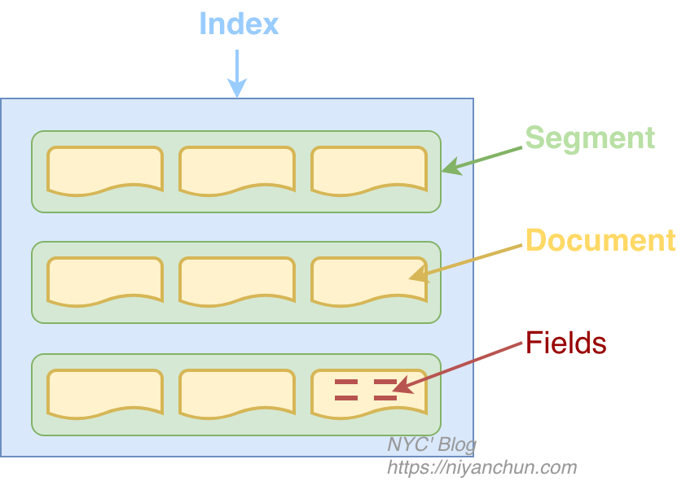

# 一、索引

## 0.术语

### 索引

索引是一个极具迷惑性的词语（真的很绕）：

- 动词：做动词时，一般英文写为“*indexing*”，比如“*索引一个文件*”翻译为“*indexing a file*”，它指的是我们将原始数据经过一系列的处理，最终形成可以高效全文检索（对于Lucene，就是生成倒排索引）的过程。这个过程就称之为**索引（indexing）**。
- 名词：做名词时，写为“*index*”。经过indexing最终形成的结果（一般以文件形式存在）称之为**索引（index）**。

Index是Lucene中的顶级逻辑结构，它是一个逻辑概念，如果对应到具体的实物，就是一个目录，目录里面所有的文件组成一个index。**注意，这个目录里面不会再嵌套目录，只会包含多个文件。**

### 文档和字段

Lucene以文档为最小单位。代码里面是这样说明的："*Documents are the unit of indexing and search*"，每个文档都会有一个唯一的文档ID。

文档里面包含若干个字段，真正的数据是存储在字段里面的。一个字段包含三个要素：***名称、类型、值\***。我们要索引数据，必须将数据以文本形式存储到字段里之后才可以。Lucene的字段由一个key-value组成，就像map一样。value支持多种类型，如果value是一个map类型，那就是嵌套字段了。

### Token和Term

Token：是存储在字段中的文本数据经过分词器分词后（准确的说是经过Tokenizer处理之后）产生的一系列词或者词组。

Term：一个Token加上它原来所属的字段的名称就构成了Term

假设有个"content"字段的存储的值为"My name is Ni Yanchun"，这个字段经过Lucene的标准分词器分词后的结果是："my", "name", "is", "ni", "yanchun"。这里的每个词就是一个**token**，"content"和"my"组成一个**term**。

我们检索的时候搜的就是Term，而不是Token或者Document（但搜到term之后，会找到包含这个term的Document，然后返回整个Document，而不是返回单个Term）。

<div style="page-break-after:always;"></div>

### Index Segment



Indexing的时候，并不是将所有数据写到一起，而是再分了一层，这层就是segment。Indexing的时候，会先将Document缓存，然后定期flush到文件。每次flush就会生成一个Segment。所以一个Index包含若干个Segment，每个Segment包含一部分Document。为了减少文件描述符的使用，这些小的Segment会定期的合并为（merge）大的Segment，数据量不大的时候，合并之后一个index可能只有一个Segment。搜索的时候，会搜索各个Segment，然后合并搜索结果。

## 1. 顺序查找

适用场景：

- like模糊查询：触发全表扫描，索引失效
- 文本编辑器中Ctrl+F查找

## 2. 倒排索引

1. 提取资源的关键信息，建立索引
2. 根据关键字，寻找资源的位置

查询前会先将**查询的内容提取出来**组成文档(正文)，

对文档进行切分词组成索引(目录)，

索引和文档有关联关系，

查询的时候先查询索引，通过索引找文档的这个过程叫做全文检索。

**倒排索引为什么更快：**

目录=字典+词典+牛津词典（用计算机查找字词时很快的）

通过**先查索引，再找文档**的方式，速度会a很快

类比于字典，通过目录查找显然比一页一页的翻更快！

<div style="page-break-after:always;"></div>

## 3. 使用场景

1. 站内搜索：贴吧，京东，淘宝
2. 垂直领域：只关注某一块方向的，例如boss（简历搜索），汽车之家，等等
3. 专业搜索引擎：baidu

### 3.1 百度搜索的原理

#### 1. 数据抓取

数据抓取系统作为整个搜索系统中的上游，主要负责互联网信息的搜集、保存、更新环节，它像蜘蛛一样在网络间爬来爬去，因此通常会被叫做“spider”。

Spider抓取系统是搜索引擎数据来源的重要保证，如果把web理解为一个有向图，那么spider的工作过程可以认为是对这个**有向图的遍历**。从一些重要的种子 URL开始，通过页面上的超链接关系，不断的发现新URL并抓取，尽最大可能抓取到更多的有价值网页。对于类似百度这样的大型spider系统，因为每时每刻都存在网页被修改、删除或出现新的超链接的可能，因此，还要对spider过去抓取过的页面保持更新，维护一个URL库和页面库（**类似于镜像仓库**）。

下图为spider抓取系统的基本框架图，其中包括链接存储系统、链接选取系统、dns解析服务系统、抓取调度系统、网页分析系统、链接提取系统、链接分析系统、网页存储系统。Baiduspider即是通过这种系统的通力合作完成对互联网页面的抓取工作。


### 3.2 检索排序

#### 1. 建立索引


1. 页面分析的过程实际上是将原始页面的**不同部分**进行识别并标记，例如：title、keywords、content、link、anchor、评论、其他非重要区域等等；
2. 分词的过程实际上包括了切词分词、同义词转换、同义词替换等等，以对某页面title分词为例，得到的将是这样的数据：term文本、termid、词类、词性等等；
3. 之前的准备工作完成后，接下来即是建立倒排索引，形成{termàdoc}，下图即是索引系统中的倒排索引过程。


#### 2. 入库写库

索引系统在建立倒排索引的最后还需要有一个入库写库的过程，而为了提高效率这个过程还需要将全部term以及偏移量保存在文件头部，并且对数据进行压缩。

#### 3. 检索

1. 对用户查询进行分词
2. 查出每个词的文档集合
3. 求交集：求交过程实际上关系着整个系统的性能，这里面包含了使用缓存等等手段进行性能优化；
4. 过滤：过滤掉死链、重复数据、色情、垃圾结果
5. 最终排序：将最能满足用户需求的结果排序在最前，可能包括的有用信息如：网站的整体评价、网页质量、内容质量、资源质量、匹配程度、分散度、时效性等等

---

搜索结果的排序维度

1，相关性：网页内容与用户检索需求的匹配程度，比如网页包含的用户检查关键词的个数，以及这些关键词出现的位置；**外部网页指向该页面所用的锚文本**等

2，权威性：用户喜欢有一定权威性网站提供的内容，相应的，百度搜索引擎也更相信优质权威站点提供的内容。

3，时效性：时效性结果指的是新出现的网页，且网页内承载了新鲜的内容。目前时效性结果在搜索引擎中日趋重要。

4，重要性：网页内容与用户检查需求匹配的重要程度或受欢迎程度

5，丰富度：丰富度看似简单却是一个覆盖范围非常广的命题。可以理解为网页内容丰富，可以完全满足用户需求；不仅可以满足用户单一需求，还可以满足用户的延展需求。

6，受欢迎程度：指该网页是不是受欢迎。

---

### 3.3 结果展现

1. 通用问答：类似于百度知道
2. 下载链接：类似于某某下载站点
3. 时间戳：时效性比较强的文章
4. 在线文档：百度文库
5. 原创标记
6. 配图

## 4. 全文索引

### 4.1 全文索引的流程


创建索引：

1. 获得文档：采集数据，数据库，本地文件，网络爬虫

2. 创建文档：文档在文档集合中，文档代表一条数据，

   包括唯一id（数据id），每个Document可以有多个Field

3. 分析文档：切分词

   vivo X23 8GB+128GB 幻夜蓝 全网通4G手机

   华为 HUAWEI 麦芒7 6G+64G 亮黑色 全网通4G手机

   vivo, x23, 8GB, 128GB, 幻夜, 幻夜蓝, 全网, 全网通, 网通, 4G, 手机，华为, HUAWEI, 麦芒7

4. 索引文档：

   | 关键字 | 文档号   | 备注     |
   | ------ | -------- | -------- |
   | 1      | 111      |          |
   | 2      | 222      |          |
   | 手机   | 222->111 | 时间顺序 |
   | vivo   | 111      |          |

   搜索过程：

   1. 创建查询：指定多个关键字之间的关系：并集交集等等
   2. 执行查询
   3. 渲染结果

<div style="page-break-after:always;"></div>

# 二、使用流程

## 1. 数据采集

## 2. 构建文档和域

```java
Document document = new Document();
document.add(new StringField("id", sku.getId(), Field.Store.YES));
```

域的属性有很多：

* 是否分词：分词的目的是为了索引。

  商品名称，商品分类等需要分词，id，订单号等不分词。

* 是否索引：进行索引。将Field分词后的词或整个Field值进行索引，存储到索引域，索引的目的是为了搜索。

* 是否存储：将Field值存储在文档域中，存储在文档域中的Field才可以从Document中获取。

  商品名称、订单号，凡是将来要从Document中获取的Field都要存储。

  商品描述，内容较大不用存储。如果要向用户展示商品描述可以从系统的关系数据库中获取。

## 3. 初始化分词器

在对Document中的内容进行索引之前，需要使用分词器进行分词 ，分词的目的是为了搜索。分词的主要过程就是先分词后过滤。

> 什么是停用词？停用词是为节省存储空间和提高搜索效率，搜索引擎在索引页面或处理搜索请求时会自动忽略某些字或词，这些字或词即被称为Stop Words(停用词)。比如语气助词、副词、介词、连接词等，通常自身并无明确的意义，只 有将其放入一个完整的句子中才有一定作用，如常见的“的”、“在”、“是”、“啊”等。

### 3.1 分词器使用的时机

#### 索引时使用Analyzer

输入关键字进行搜索，当需要让该关键字与文档域内容所包含的词进行匹配时需要对文档域内容进行分析，需要经过Analyzer分析器处理生成**语汇单元（Token）**。

分析器分析的对象是文档中的**Field域**。当Field的属性tokenized（是否分词）为true时会对Field值进行分析。

#### 搜索时使用Analyzer

对搜索关键字进行分析和索引分析一样，使用Analyzer对搜索关键字进行分析、分词处理，使用分析后每个词语进行搜索。比如：搜索关键字：spring web ，经过分析器进行分词，得出：spring web拿词去索引词典表查找 ，找到索引链接到Document，解析Document内容。
对于匹配整体Field域的查询可以在搜索时不分析，比如根据订单号、身份证号查询等。

<div style="page-break-after:always;"></div>

### 3.2 分词器

#### StandardAnalyzer

Lucene提供的标准分词器, 可以对用英文进行分词, 对中文是单字分词, 也就是一个字就认为是一个词。

```java
protected TokenStreamComponents createComponents(String fieldName) {
    final StandardTokenizer src = new StandardTokenizer();
    src.setMaxTokenLength(this.maxTokenLength);
    TokenStream tok = new LowerCaseFilter(src);
    TokenStream tok = new StopFilter(tok, this.stopwords);
    return new TokenStreamComponents(src, tok) {
            protected void setReader(Reader reader) {
            src.setMaxTokenLength(StandardAnalyzer.this.maxTokenLength);
            super.setReader(reader);
        }
    };
}
```


Tokenizer就是分词器，负责将reader转换为语汇单元即进行分词处理，Lucene提供了很多的分词器，也可以使用第三方的分词，比如IKAnalyzer一个中文分词器。

TokenFilter是分词过滤器，负责对语汇单元进行过滤，TokenFilter可以是一个过滤器链儿，Lucene提供了很多的分词器过滤器，比如大小写转换、去除停用词等。

语汇单元的生成过程：

Reader->Tokenizer(分词)->TokenFilter(标准过滤)->TokenFilter(大小写过滤)->TokenFilter(停用词过滤)->Tokens

#### IKAnalyzer

适用于中文的分词器

##### 停用词典stopword.dic作用 :

停用词典中的词例如: a, an, the, 的, 地, 得等词汇, 凡是出现在停用词典中的字或者词, 在切分词的时候会被过滤掉.

##### 扩展词典ext.dic作用 :

扩展词典中的词例如: 传智播客, 黑马程序员, 贵州茅台等专有名词, 在汉语中一些公司名称, 行业名称, 分类, 品牌等不是汉语中的词汇, 是专有名词. 这些分词器默认不识别, 所以需要放入扩展词典中, 效果是被强制分成一个词.

<div style="page-break-after:always;"></div>

## 4. 初始化IndexWriter输出流对象

IndexWriter对象用于把文件写入到磁盘里，在初始化它之前，需要配置输出的位置和config对象：

```java
// 输出路径
Directory  dir = FSDirectory.open(Paths.get("C:\\dir_lucene\\index"));
// config
IndexWriterConfig config = new IndexWriterConfig(analyzer);

// 持久化
IndexWriter indexWriter = new IndexWriter(dir, config);

for (Document doc : docList) {
    indexWriter.addDocument(doc);
}

indexWriter.close();
```

<div style="page-break-after:always;"></div>

# 三、Lucene底层存储结构

## 1. 索引目录：

```
segments_1
write.lock
_0.cfe
_0.cfs
_0.si
```

## 2. 段：

Lunece索引通过分段存储的方式，解决了单个文件难以维护的缺点。

### 数据操作过程：

- 新增。当有新的数据需要创建索引时，**由于段的不变性**，所以选择新建一个段来存储新增的数据。

- 删除。当需要删除数据时，由于数据所在的段只可读，不可写，所以Lucene在索引文件下新增了一个.del的文件，用来专门存储被删除的数据id。当查询时，被删除的数据还是可以被查到的，只是在进行文档链表合并时，才把已经删除的数据过滤掉。被删除的数据在进行段合并时才会真正被移除。

- 更新。更新的操作其实就是删除和新增的组合，先在.del文件中记录旧数据，再在新段中添加一条更新后的数据。

### **段不变性的优点**：

- 不需要锁。因为数据不会更新，所以不用考虑多线程下的读写不一致情况。
- 可以常驻内存。段在被加载到内存后，由于具有不变性，所以只要内存的空间足够大，就可以长时间驻存，大部分查询请求会直接访问内存，而不需要访问磁盘，使得查询的性能有很大的提升。
- 缓存友好。在段的声明周期内始终有效，不需要在每次数据更新时被重建。
- 增量创建。分段可以做到增量创建索引，可以轻量级地对数据进行更新，由于每次创建的成本很低，所以可以频繁地更新数据，使系统接近实时更新。

缺点：

- 删除是标记的方式，比较浪费
- 更新，是两个所作组成
- 每次新增数据都需要新增段
- 查询需要过滤

为了提升写的性能，Lucene并没有每新增一条数据就增加一个段，而是采用延迟写的策略，每当有新增的数据时，就将其先写入内存中，然后批量写入磁盘中。若有一个段被写到硬盘，就会生成一个提交点，提交点就是一个用来记录所有提交后的段信息的文件。一个段一旦拥有了提交点，就说明这个段只有读的权限，失去了写的权限；相反，当段在内存中时，就只有写数据的权限，而不具备读数据的权限，所以也就不能被检索了。从严格意义上来说，Lucene或者Elasticsearch并不能被称为实时的搜索引擎，只能被称为准实时的搜索引擎。

### **写索引的流程**：

- 新数据暂时写入内存中，数据量很多时，再提交到磁盘上
- 在达到触发条件以后，会将内存中缓存的数据一次性写入磁盘中，并生成提交点
- 清空内存，等待新的数据写入

### 段合并的策略：

长时间的积累，会导致在索引中存在大量的段，当索引中段的数量太多时，不仅会严重消耗服务器的资源，还会影响检索的性能。

根据段的大小先将段进行分组，再将属于同一组的段进行合并。但是由于对超级大的段的合并需要消耗更多的资源，所以Lucene会在段的大小达到一定规模，或者段里面的数据量达到一定条数时，不会再进行合并。**Lucene的段合并主要集中在对中小段的合并上**，这样既可以避免对大段进行合并时消耗过多的服务器资源，也可以很好地控制索引中段的数量。

**段合并的参数：**

- mergeFactor：每次合并时参与**合并的段的最少数量**，当同一组的段的数量达到此值时开始合并，如果小于此值则不合并，这样做可以减少段合并的频率，其默认值为10。
- SegmentSize：指段的实际大小，单位为字节。
- minMergeSize：小于这个值的段会被分到一组，这样可以加速小片段的合并。
- maxMergeSize：若一个段的文本数量大于此值，就不再参与合并，因为大段合并会消耗更多的资源。

**段合并相关的动作是：**

- 段分组：大小相近的段分到一组
- 段合并：同一组中的段合并为更大的段

## 3. 索引库文件

|     Name      |   .file    |                           说明                            |
| :-----------: | :--------: | :-------------------------------------------------------: |
| Segment Info  |    .si     |                 保存了索引段的元数据信息                  |
| Compound File | .cfs，.cfe | 一个可选的虚拟文件，把所有索引信息都存储到复合索 引文件中 |
|   Lock File   | write.lock |         防止多个IndexWriter同时写到一份索引文件中         |
| Segments File | segments_N |         保存了一个提交点（a commit point）的信息          |

## 4. 词典构建

为何Lucene大数据量搜索快, 要分两部分来看 :

- 一点是因为底层的倒排索引存储结构
- 另一点就是查询关键字的时候速度快, 因为词典的索引结构

**跳表**

优点：结构简单， 跳跃间隔、级数可控。Lucene3.0之前使用的也是跳跃表结构，，但跳跃表在Lucene其他地方还有应用如倒排表合并和文档号索引。

缺点 ：模糊查询支持不好.

**FST**

优点：内存占用低，压缩率高

缺点：结构复杂，输入要求有序

已知FST要求输入有序，所以Lucene会将解析出来的文档单词预先排序，然后构建FST。

我们假设输入为abd,abe,acf,acg，那么整个构建过程如下：

```
    a           a         a              a
   /           /         / \            / \
  b           b         b   c          b   c
 /           / \       / \  /         / \ / \
d           d   e     d  e f         d  e f  g
```

## 5. 优化

**磁盘IO**

- `config.setMaxBufferedDocs`(100000); （设置缓存）控制写入一个新的segment前内存中保存的document的数目，设置较大的数目可以加快建索引速度。 **数值越大索引速度越快, 但是会消耗更多的内存。**
- `indexWriter.forceMerge`(文档数量); 设置N个文档合并为一个段。 **数值越大索引速度越快, 搜索速度越慢; 值越小索引速度越慢, 搜索速度越快。** 更高的值意味着索引期间更低的段合并开销，但同时也意味着更慢的搜索速度，因为此时的索引通常会包含更多的段。如果该值设置的过高，能获得更高的索引性能。但若在最后进行索引优化，那么较低的值会带来更快的搜索速度，因为在索引操作期间程序会利用并发机制完成段合并操作。故建议对程序分别进行高低多种值的测试，利用计算机的实际性能来告诉你最优值。

## 6. 相关度排序

1**. 分值**

Lucene是在用户进行检索时实时根据搜索的关键字计算出来的，分两步：

1. 计算出词（Term）的权重
2. 根据词的权重值，计算文档相关度得分。

**2. 权重**

确索引的最小单位是一个Term(索引词典中的一个词)，搜索也是要从Term中搜索，再根据Term找到文档，Term对文档的重要性称为权重，影响Term权重有两个因素：

- Term Frequency (tf)： 指此Term在此文档中出现了多少次。tf 越大说明越重要。 词(Term)在文档 中出现的次数越多，说明此词(Term)对该文档越重要，如“Lucene”这个词，在文档中出现的次数 很多，说明该文档主要就是讲Lucene技术的。
- Document Frequency (df)： 指有多少文档包含次Term。df 越大说明越不重要。 比如，在一篇英语文档中，this出现的次数更多，就说明越重要吗？不是的，有越多的文档包含此词(Term), 说明 此词(Term)太普通，不足以区分这些文档，因而重要性越低。

**3. 排序**

boost是一个加权值（默认加权值为1.0f），它可以影响权重的计算。

- 在索引时对某个文档中的field设置加权值高，在搜索时匹配到这个文档就可能排在前边。
- 在搜索时对某个域进行加权，在进行组合域查询时，匹配到加权值高的域最后计算的相关度得分就高。

设置boost是给域（field）或者Document设置的。

<div style="page-break-after:always;"></div>

# 四、性能篇

## 1. 索引的生成过程


在索引文件的过程中， Lucene 不是直接将文件索引放到到磁盘上，而是首先缓存，然后在写到磁盘。

索引过程的瓶颈

- 往磁盘上写索引文件的过程，从内存到磁盘
- 将磁盘上的几个小 Segment 合并成一个大的 Segment 的过程

## 2. 索引创建慢的解决思路

1. 使用本地文件系统而不是远程文件系统

2. 重用Document和Field实例： 创建单一的Document实例，添加相应的字段，然后复用

   ```java
   // 类似于
   Document document = new Document();
   Field idField = new StringField("id", "none", Field.Store.YES);
   document.add(idField);
   
   indexWriter... // 相关
       
   for (Data data: datas){
       idField.setStringValue(data.getId());
       indexWriter.addDocument(document);
   }
   ```

3. 加大合并因子

   ```java
   // 内存中保存的Doc数目
   config.setMaxBufferedDocs(500000);
   
   // 设置段内的文档数目 
   indexWriter.forceMerge(500000);
   ```


<div style="page-break-after:always;"></div>

# 五、搜索流程

创建查询

执行搜索

渲染结果

```java
public void testIndexSearch() throws Exception {

    //1. 创建分词器(对搜索的关键词进行分词使用)
    //注意: 分词器要和创建索引的时候使用的分词器一模一样
    Analyzer analyzer = new StandardAnalyzer();

    //2. 创建查询对象,
    //第一个参数: 默认查询域, 如果查询的关键字中带搜索的域名, 则从指定域中查询, 如果不带域名则从, 默认搜索域中查询
    //第二个参数: 使用的分词器
    QueryParser queryParser = new QueryParser("name", analyzer);

    //3. 设置搜索关键词
    //华  为   手   机
    Query query = queryParser.parse("华为手机");

    //4. 创建Directory目录对象, 指定索引库的位置
    Directory dir = FSDirectory.open(Paths.get("C:\\dir_lucene\\index"));
    //5. 创建输入流对象
    IndexReader indexReader = DirectoryReader.open(dir);
    //6. 创建搜索对象
    IndexSearcher indexSearcher = new IndexSearcher(indexReader);
    //7. 搜索, 并返回结果
    //第二个参数: 是返回多少条数据用于展示, 分页使用
    TopDocs topDocs = indexSearcher.search(query, 10);

    //获取查询到的结果集的总数, 打印
    System.out.println("=======count=======" + topDocs.totalHits);

    //8. 获取结果集
    ScoreDoc[] scoreDocs = topDocs.scoreDocs;

    //9. 遍历结果集
    if (scoreDocs != null) {
        for (ScoreDoc scoreDoc : scoreDocs) {
            //获取查询到的文档唯一标识, 文档id, 这个id是lucene在创建文档的时候自动分配的
            int  docID = scoreDoc.doc;
            //通过文档id, 读取文档
            Document doc = indexSearcher.doc(docID);
            System.out.println("==================================================");
            //通过域名, 从文档中获取域值
            System.out.println("===id==" + doc.get("id"));
            System.out.println("===name==" + doc.get("name"));
            System.out.println("===price==" + doc.get("price"));
            System.out.println("===image==" + doc.get("image"));
            System.out.println("===brandName==" + doc.get("brandName"));
            System.out.println("===categoryName==" + doc.get("categoryName"));
        }
    }
    //10. 关闭流
}
```

<div style="page-break-after:always;"></div>

# 六、索引文件大小

保持索引文件大小为一个可以接受的范围，不仅可以提高索引传输、读取速度，还能提高索引cache效率（lucene打开索引文件的时候往往会进行缓存，比如MMapDirectory通过内存映射方式进行缓存）。

## 1. 数值数据类型的索引优化

lucene本质上是一个全文检索引擎而非传统的数据库系统，它基于倒排索引，非常适合处理文本，而处理数值类型却不是强项。

> 假设我们倒排存储的是商家，每个商家都有人均消费，用户想查询范围在500~1000这一价格区间内的商家。


一种简单直接的想法就是，将商家人均消费当做字符串写入倒排（如图所示），在进行区间查询时：

1. 遍历价格分词表，将落在此区间范围内的倒排id记录表找出来；
2. 合并倒排id记录表。

问题：

1. 价格分词表需要遍历，比较耗时间。查询到的id记录表也可能有很多，性能较差。
2. 合并倒排id记录表非常耗时

<div style="page-break-after:always;"></div>

**基于Trie树的解决办法**：

Trie树：Trie 树，也叫“字典树”。它是一种专门处理**字符串匹配**的树形数据结构，用来解决在一组字符串集合中快速查找某个字符串的问题。

Trie 树的本质，就是利用字符串之间的公共前缀，将重复的前缀合并在一起。


其中，根节点不包含任何信息。每个节点表示一个字符串中的字符，从根节点到红色节点的一条路径表示一个字符串。

对于数值来说，整数423不是直接写入倒排，而是分割成几段写入倒排，以十进制分割为例，423将被分割为423、42、4这三个term写入， 本质上这些term形成了trie树。


利用这种方式，可以做到**很快的搜索分词表**。

**优化思路**

假设应用中很多field都是数值类型，比如id、avescore（评价分）、price（价格）等等，但是用于区间范围查询的数值类型非常少，大部分都是直接查询或者为进行排序使用。

lucene也提供了precisionstep这一字段用于**设置分割长度**，默认情况下int、double、float等数字类型precisionstep为4，就是按4位二进制进行分割。precisionstep长度设置得**越短**，分割的term**越多**，大范围**查询速度也越快**，precisionstep设置得越长，极端情况下设置为无穷大，**那么不会进行trie分割，范围查询也没有优化效果**，precisionstep长度需要结合自身业务进行优化。

因此优化方法非常简单，将不需要使用范围查询的数字字段设置precisionstep为Intger.max，这样数字写入倒排仅存一个term，能极大降低term数量。

<div style="page-break-after:always;"></div>

# 七、元数据

元数据，简单定义就是描述数据的数据。在企业中，只要有数据存在的地方，就有其对应元数据。

## 1. 技术元数据

1、物理元数据

描述物理资源的元数据，包括但不限于服务器、操作系统、机房位置等信息。

2、数据源元数据

描述数据源的元数据，通常包括四类信息：

- 数据源地址（IP、PORT等）
- 物理拓扑（主备、角色等）
- 权限（用户名、口令等）
- 库名、版本、域名等

3、存储元数据

描述对象存储的元数据，也是通常"狭义"上的元数据，包括几大类

- 管理属性（创建人、应用系统、业务线、业务负责人等）

- 生命周期（创建时间、DDL时间、版本信息等）

- 存储属性（位置、物理大小等）

- 数据特征（数据倾斜、平均长度等）

- 使用特征（DML、刷新率等）

- 数据结构

- - 表/分区（名称、类型、备注等）
  - 列（名称、类型、长度、精度等）
  - 索引（名称、类型、字段等）
  - 约束（类型、字段等）

4、计算元数据

描述数据计算过程的元数据，通常可分为数据抽取（ETL）或数据加工（JOB）两类计算。每类计算又可以进一步细分

- 控制元数据（配置属性、调度策略等）
- 过程元数据（依赖关系、执行状态、执行日志等）

5、质量元数据

描述数据质量的一类元数据。通常情况下，是通过定义一系列质量指标反映数据质量。

6、操作元数据

描述数据是如何进行使用的一类元数据。

- 数据产生（产生时间、作业信息等）
- 表访问（查询、关联、聚合等）
- 表关联（关联表、关联字段、关联类型、关联次数）
- 字段访问（查询、关联、聚合、过滤等）

7、运维元数据

描述系统运维层面的元数据，通常包括任务类、报警类及故障类。

8、成本元数据

描述数据存储及计算成本的元数据。

- 计算成本（CPU、MEM等）
- 存储成本（空间、压缩率等）

9、标准元数据

描述数据标准化内容的元数据。

- 代码管理（转换规则、对外接口等）
- 映射管理
- 数据展示（样式、规则、语义、单位等）

10、安全元数据

描述数据安全内容的元数据。

- 安全等级
- 数据敏感性（是否敏感、脱敏算法等）

11、共享元数据

描述数据是如何共享的部分，包括接口方式、格式、内容等。

## 2. 业务元数据

1、模型元数据

数据建模，是一种对业务的描述，通过模型可更好地了解业务。常见的建模方式有范式模型、维度模型、多维建模等。下面以维度模型为例进行说明。

- 业务线、板块、过程
- 数据域、主题域
- 维度、属性
- 指标
- 事实、度量
- 集市与应用

2、应用元数据

描述数据应用类的元数据。

3、分析元数据

从数据分析角度，描述业务的元数据。

- 数据域、主题域
- 产品线、板块、业务过程
- 业务流程
- 业务规则

## 3. 管理元数据

1、管理元数据

描述企业内部，数据管理相关内容。

- 人员
- 流程
- 职责、岗位
- 组织、部门

<div style="page-break-after:always;"></div>

# 八、多线程优化

继承IndexWriter：

```java
public class ThreadedIndexWriter extends IndexWriter{
    private ExecutorService threadPool;
}
```

创建内部类Job：

```java
private class Job implements Runnable{
    Document doc;

    public Job(Document doc) {
        this.doc = doc;
    }

    @Override
    public void run() {
        try {
            ThreadedIndexWriter.super.addDocument(doc);
        } catch (IOException ioe) {
            throw new RuntimeException(ioe);
        }
    }
}
```


重写构造：

```java
public ThreadedIndexWriter(Directory d, IndexWriterConfig conf, int numThreads, int maxQueueSize) 
    throws IOException {
    super(d, conf);

    threadPool = new ThreadPoolExecutor(
        numThreads, maxQueueSize,
        0, TimeUnit.SECONDS,
        new ArrayBlockingQueue<>(maxQueueSize, false),
        new ThreadPoolExecutor.CallerRunsPolicy()
    );
}
```

重写addDocument和close：

```java
public void addDocument(Document doc){
    // 丢入线程池执行
    threadPool.execute(new Job(doc));
}

public void close() throws IOException{
    finish();
    super.close();
}

private void finish() {
    threadPool.shutdown();
    while (true){
        try {
            if(threadPool.awaitTermination(Long.MAX_VALUE, TimeUnit.SECONDS)) {
                break;
            }
        } catch (InterruptedException e) {
            Thread.currentThread().interrupt();
            e.printStackTrace();
        }
    }
}
```


结果：

| 线程数 | 1      | 1（线程池） | 2      | 4      | 8      |
| ------ | ------ | ----------- | ------ | ------ | ------ |
| 时间   | 15.54s | 18.99s      | 18.46s | 13.88s | 20.19s |


在数据量较小时Lucene单线程的优化已经足够好，需要数据量更多时才能体现出多线程的优势。

<div style="page-break-after:always;"></div>

# 九、版本间对比

## 1. 实验数据

基于京东商城生成的数据，包括：

商品id、商品名称、商品价格、商品数量、图片地址、商品分类、品牌名、商品描述


`SELECT count(*) as Nums FROM tb_sku`

`937864`

数据导出为csv文件

### Field设计

|   名称   |        是否分词        | 是否索引 |        是否存储        |
| :------: | :--------------------: | :------: | :--------------------: |
|  商品id  | 否（不考虑id模糊搜索） |    是    |  是（查询结果页使用）  |
| 商品名称 | 是（名称是搜索的依据） |    是    |           是           |
| 商品价格 |   是（价格范围查询）   |    是    |           是           |
| 商品数量 |           -            |    -     |           -            |
| 图片地址 |           否           |    否    |           是           |
| 商品分类 | 否（分类名是一个整体） |    是    |           是           |
|  品牌名  | 否（品牌名是一个整体） |    是    |           是           |
| 商品描述 |           是           |    要    | 否（内容量大，不存储） |

<div style="page-break-after:always;"></div>

## 2. 版本对比

### 8.6.1

代码

```java
Document document = new Document();

Field idField = new StringField("id", "none", Field.Store.YES);
Field nameField = new TextField("name", "none", Field.Store.YES);
IntPoint price = new IntPoint("price", 0);
Field price1 = new StoredField("price", 0);
Field imageField = new StoredField("image", "none");
Field cnameField = new StringField("categoryName", "none", Field.Store.YES);
Field bnameField = new StringField("brandName", "none", Field.Store.YES);
```

耗时 17 s


使用`config.setUseCompoundFile(false);`

耗时15s 生成了小文件


在数据量更大的时候，使用小文件有一定的优势

<div style="page-break-after:always;"></div>

### 3.5.0

代码

```java
// id：不分词，要索引，要存储
Field idField = new Field("id", "none", Field.Store.YES, Field.Index.NOT_ANALYZED);
// name：要分词，要索引，要存储
Field nameField = new Field("name", "none", Field.Store.YES, Field.Index.ANALYZED);
// price：NumericField，要索引，要存储
NumericField priceField = new NumericField("price", Field.Store.YES, true);
// 图片：不分词，不索引，要存储
Field imageField = new Field("image", "none", Field.Store.YES, Field.Index.NO);
// 分类：不分词，要索引，要存储
Field cnameField = new Field("categoryName", "none", Field.Store.YES, Field.Index.NOT_ANALYZED);
Field bnameField = new Field("brandName", "none", Field.Store.YES, Field.Index.NOT_ANALYZED);
```

结果

```java
// 使用IK分词器报错
java.lang.AbstractMethodError: Receiver class org.wltea.analyzer.lucene.IKAnalyzer does not define or inherit an implementation of the resolved method 'abstract org.apache.lucene.analysis.TokenStream tokenStream(java.lang.String, java.io.Reader)' of abstract class org.apache.lucene.analysis.Analyzer.

```

使用标准分词器

```
耗时 15 s
```

索引


|          | 8.6.1  | 8.6.1 | 3.5.0 |
| :------: | :----: | :---: | :---: |
|   时间   |   17   |  15s  |  15s  |
| 索引大小 | 38.8MB | 38.8  | 271MB |
| 文件数量 |   20   |  92   |  83   |


## 3. 结论

高版本的lucene在**索引生成时间**上没有特别的优势，但是生成的索引文件明显减少了很多。

### Lucene存储segment的方式

>  When using the Compound File format (default in 1.4 and greater) these files are collapsed into a single .cfs file (see below for details)

- **multifile格式**。该模式下会产生很多文件，不同的文件存储不同的信息，其弊端是读取index时需要打开很多文件，可能造成文件描述符超出系统限制。
- **compound格式**。一般简写为CFS(Compound File System)，该模式下会将很多小文件合并成一个大文件，以减少文件描述符的使用。

---

- `write.lock`：每个index目录都会有一个该文件，用于防止多个IndexWriter同时写一个文件。
- `segments_N`：该文件记录index所有segment的相关信息，比如该索引包含了哪些segment。IndexWriter每次commit都会生成一个（N的值会递增），新文件生成后旧文件就会删除。所以也说该文件用于保存commit point信息。