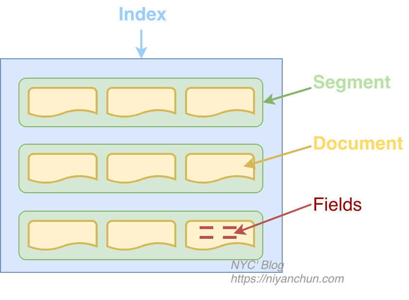
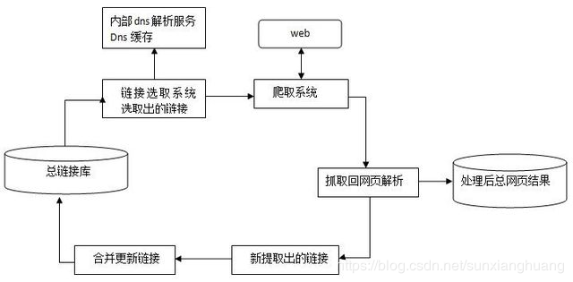
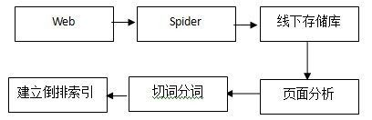
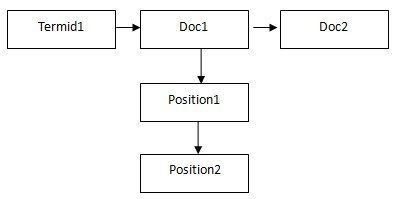
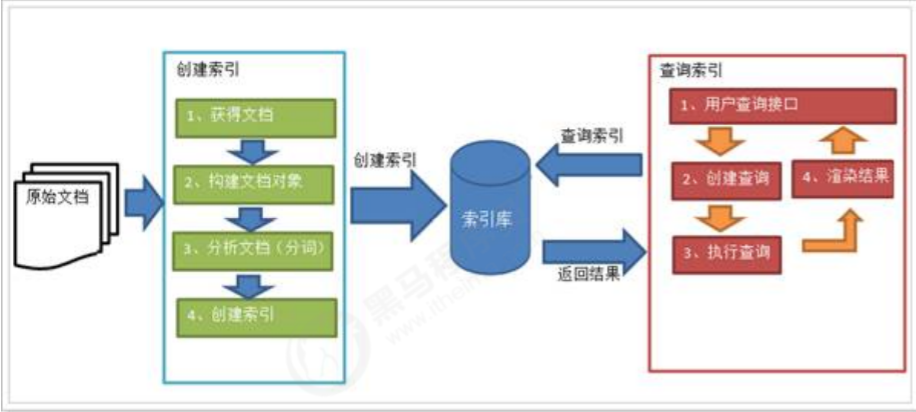

# 一、索引

## 0.术语

### 索引

索引是一个极具迷惑性的词语（真的很绕）：

- 动词：做动词时，一般英文写为“*indexing*”，比如“*索引一个文件*”翻译为“*indexing a file*”，它指的是我们将原始数据经过一系列的处理，最终形成可以高效全文检索（对于Lucene，就是生成倒排索引）的过程。这个过程就称之为**索引（indexing）**。
- 名词：做名词时，写为“*index*”。经过indexing最终形成的结果（一般以文件形式存在）称之为**索引（index）**。

Index是Lucene中的顶级逻辑结构，它是一个逻辑概念，如果对应到具体的实物，就是一个目录，目录里面所有的文件组成一个index。**注意，这个目录里面不会再嵌套目录，只会包含多个文件。**

### 文档和字段

Lucene以文档为最小单位。代码里面是这样说明的："*Documents are the unit of indexing and search*"，每个文档都会有一个唯一的文档ID。

文档里面包含若干个字段，真正的数据是存储在字段里面的。一个字段包含三个要素：***名称、类型、值\***。我们要索引数据，必须将数据以文本形式存储到字段里之后才可以。Lucene的字段由一个key-value组成，就像map一样。value支持多种类型，如果value是一个map类型，那就是嵌套字段了。

### Token和Term

Token：是存储在字段中的文本数据经过分词器分词后（准确的说是经过Tokenizer处理之后）产生的一系列词或者词组。

Term：一个Token加上它原来所属的字段的名称就构成了Term

假设有个"content"字段的存储的值为"My name is Ni Yanchun"，这个字段经过Lucene的标准分词器分词后的结果是："my", "name", "is", "ni", "yanchun"。这里的每个词就是一个**token**，"content"和"my"组成一个**term**。

我们检索的时候搜的就是Term，而不是Token或者Document（但搜到term之后，会找到包含这个term的Document，然后返回整个Document，而不是返回单个Term）。

### Index Segment

Indexing的时候，并不是将所有数据写到一起，而是再分了一层，这层就是segment。Indexing的时候，会先将Document缓存，然后定期flush到文件。每次flush就会生成一个Segment。所以一个Index包含若干个Segment，每个Segment包含一部分Document。为了减少文件描述符的使用，这些小的Segment会定期的合并为（merge）大的Segment，数据量不大的时候，合并之后一个index可能只有一个Segment。搜索的时候，会搜索各个Segment，然后合并搜索结果。

## 1. 顺序查找

适用场景：

- like模糊查询：触发全表扫描，索引失效
- 文本编辑器中Ctrl+F查找

## 2. 倒排索引

1. 提取资源的关键信息，建立索引
2. 根据关键字，寻找资源的位置

查询前会先将**查询的内容提取出来**组成文档(正文)，

对文档进行切分词组成索引(目录)，

索引和文档有关联关系，

查询的时候先查询索引，通过索引找文档的这个过程叫做全文检索。

**倒排索引为什么更快：**

目录=字典+词典+牛津词典（用计算机查找字词时很快的）

通过**先查索引，再找文档**的方式，速度会a很快

类比于字典，通过目录查找显然比一页一页的翻更快！

## 3. 使用场景

1. 站内搜索：贴吧，京东，淘宝
2. 垂直领域：只关注某一块方向的，例如boss（简历搜索），汽车之家，等等
3. 专业搜索引擎：baidu

### 3.1 百度搜索的原理

#### 1. 数据抓取

数据抓取系统作为整个搜索系统中的上游，主要负责互联网信息的搜集、保存、更新环节，它像蜘蛛一样在网络间爬来爬去，因此通常会被叫做“spider”。

Spider抓取系统是搜索引擎数据来源的重要保证，如果把web理解为一个有向图，那么spider的工作过程可以认为是对这个**有向图的遍历**。从一些重要的种子 URL开始，通过页面上的超链接关系，不断的发现新URL并抓取，尽最大可能抓取到更多的有价值网页。对于类似百度这样的大型spider系统，因为每时每刻都存在网页被修改、删除或出现新的超链接的可能，因此，还要对spider过去抓取过的页面保持更新，维护一个URL库和页面库（**类似于镜像仓库**）。

下图为spider抓取系统的基本框架图，其中包括链接存储系统、链接选取系统、dns解析服务系统、抓取调度系统、网页分析系统、链接提取系统、链接分析系统、网页存储系统。Baiduspider即是通过这种系统的通力合作完成对互联网页面的抓取工作。

### 3.2 检索排序

#### 1. 建立索引

1. 页面分析的过程实际上是将原始页面的**不同部分**进行识别并标记，例如：title、keywords、content、link、anchor、评论、其他非重要区域等等；
2. 分词的过程实际上包括了切词分词、同义词转换、同义词替换等等，以对某页面title分词为例，得到的将是这样的数据：term文本、termid、词类、词性等等；
3. 之前的准备工作完成后，接下来即是建立倒排索引，形成{termàdoc}，下图即是索引系统中的倒排索引过程。

#### 2. 入库写库

索引系统在建立倒排索引的最后还需要有一个入库写库的过程，而为了提高效率这个过程还需要将全部term以及偏移量保存在文件头部，并且对数据进行压缩。

#### 3. 检索

1. 对用户查询进行分词
2. 查出每个词的文档集合
3. 求交集：求交过程实际上关系着整个系统的性能，这里面包含了使用缓存等等手段进行性能优化；
4. 过滤：过滤掉死链、重复数据、色情、垃圾结果
5. 最终排序：将最能满足用户需求的结果排序在最前，可能包括的有用信息如：网站的整体评价、网页质量、内容质量、资源质量、匹配程度、分散度、时效性等等

---

搜索结果的排序维度

1，相关性：网页内容与用户检索需求的匹配程度，比如网页包含的用户检查关键词的个数，以及这些关键词出现的位置；**外部网页指向该页面所用的锚文本**等

2，权威性：用户喜欢有一定权威性网站提供的内容，相应的，百度搜索引擎也更相信优质权威站点提供的内容。

3，时效性：时效性结果指的是新出现的网页，且网页内承载了新鲜的内容。目前时效性结果在搜索引擎中日趋重要。

4，重要性：网页内容与用户检查需求匹配的重要程度或受欢迎程度

5，丰富度：丰富度看似简单却是一个覆盖范围非常广的命题。可以理解为网页内容丰富，可以完全满足用户需求；不仅可以满足用户单一需求，还可以满足用户的延展需求。

6，受欢迎程度：指该网页是不是受欢迎。

---

### 3.3 结果展现

1. 通用问答：类似于百度知道
2. 下载链接：类似于某某下载站点
3. 时间戳：时效性比较强的文章
4. 在线文档：百度文库
5. 原创标记
6. 配图

## 4. 全文索引

### 4.1 全文索引的流程

创建索引：

1. 获得文档：采集数据，数据库，本地文件，网络爬虫

2. 创建文档：文档在文档集合中，文档代表一条数据，

   包括唯一id（数据id），每个Document可以有多个Field

3. 分析文档：切分词

   vivo X23 8GB+128GB 幻夜蓝 全网通4G手机

   华为 HUAWEI 麦芒7 6G+64G 亮黑色 全网通4G手机

   vivo, x23, 8GB, 128GB, 幻夜, 幻夜蓝, 全网, 全网通, 网通, 4G, 手机，华为, HUAWEI, 麦芒7

4. 索引文档：

   | 关键字 | 文档号   | 备注     |
   | ------ | -------- | -------- |
   | 1      | 111      |          |
   | 2      | 222      |          |
   | 手机   | 222->111 | 时间顺序 |
   | vivo   | 111      |          |

   搜索过程：

   1. 创建查询：指定多个关键字之间的关系：并集交集等等
   2. 执行查询
   3. 渲染结果

