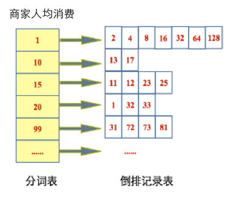
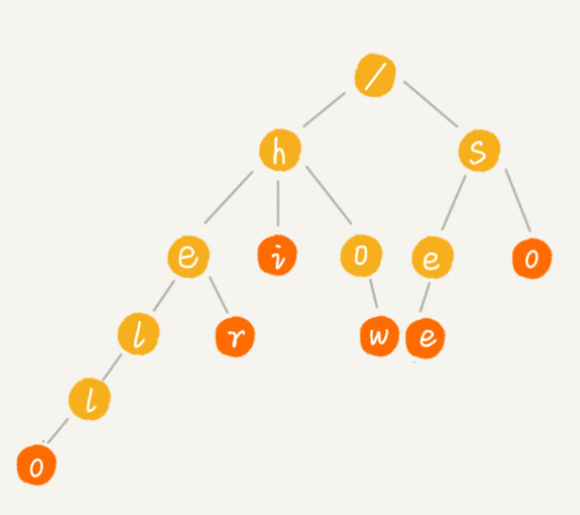

# 六、索引文件大小

保持索引文件大小为一个可以接受的范围，不仅可以提高索引传输、读取速度，还能提高索引cache效率（lucene打开索引文件的时候往往会进行缓存，比如MMapDirectory通过内存映射方式进行缓存）。

## 1. 数值数据类型的索引优化

lucene本质上是一个全文检索引擎而非传统的数据库系统，它基于倒排索引，非常适合处理文本，而处理数值类型却不是强项。

> 假设我们倒排存储的是商家，每个商家都有人均消费，用户想查询范围在500~1000这一价格区间内的商家。

一种简单直接的想法就是，将商家人均消费当做字符串写入倒排（如图所示），在进行区间查询时：

1. 遍历价格分词表，将落在此区间范围内的倒排id记录表找出来；
2. 合并倒排id记录表。

问题：

1. 价格分词表需要遍历，比较耗时间。查询到的id记录表也可能有很多，性能较差。
2. 合并倒排id记录表非常耗时

**基于Trie树的解决办法**：

Trie树：Trie 树，也叫“字典树”。它是一种专门处理**字符串匹配**的树形数据结构，用来解决在一组字符串集合中快速查找某个字符串的问题。

Trie 树的本质，就是利用字符串之间的公共前缀，将重复的前缀合并在一起。

其中，根节点不包含任何信息。每个节点表示一个字符串中的字符，从根节点到红色节点的一条路径表示一个字符串。

对于数值来说，整数423不是直接写入倒排，而是分割成几段写入倒排，以十进制分割为例，423将被分割为423、42、4这三个term写入， 本质上这些term形成了trie树。

利用这种方式，可以做到**很快的搜索分词表**。

**优化思路**

假设应用中很多field都是数值类型，比如id、avescore（评价分）、price（价格）等等，但是用于区间范围查询的数值类型非常少，大部分都是直接查询或者为进行排序使用。

lucene也提供了precisionstep这一字段用于**设置分割长度**，默认情况下int、double、float等数字类型precisionstep为4，就是按4位二进制进行分割。precisionstep长度设置得**越短**，分割的term**越多**，大范围**查询速度也越快**，precisionstep设置得越长，极端情况下设置为无穷大，**那么不会进行trie分割，范围查询也没有优化效果**，precisionstep长度需要结合自身业务进行优化。

因此优化方法非常简单，将不需要使用范围查询的数字字段设置precisionstep为Intger.max，这样数字写入倒排仅存一个term，能极大降低term数量。

