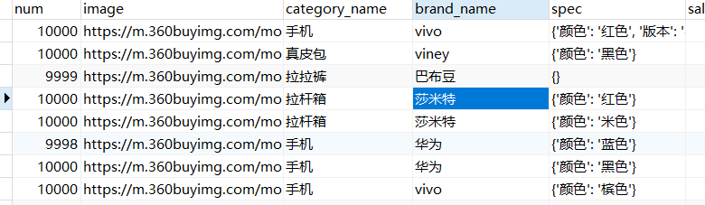

# 九、版本间对比

## 1. 实验数据

基于京东商城生成的数据，包括：

商品id、商品名称、商品价格、商品数量、图片地址、商品分类、品牌名、商品描述



`SELECT count(*) as Nums FROM tb_sku`

`937864`

数据导出为csv文件

### Field设计

|   名称   |        是否分词        | 是否索引 |        是否存储        |
| :------: | :--------------------: | :------: | :--------------------: |
|  商品id  | 否（不考虑id模糊搜索） |    是    |  是（查询结果页使用）  |
| 商品名称 | 是（名称是搜索的依据） |    是    |           是           |
| 商品价格 |   是（价格范围查询）   |    是    |           是           |
| 商品数量 |           -            |    -     |           -            |
| 图片地址 |           否           |    否    |           是           |
| 商品分类 | 否（分类名是一个整体） |    是    |           是           |
|  品牌名  | 否（品牌名是一个整体） |    是    |           是           |
| 商品描述 |           是           |    要    | 否（内容量大，不存储） |

## 2. 版本对比

## 8.6.1

代码

```java
Document document = new Document();

Field idField = new StringField("id", "none", Field.Store.YES);
Field nameField = new TextField("name", "none", Field.Store.YES);
IntPoint price = new IntPoint("price", 0);
Field price1 = new StoredField("price", 0);
Field imageField = new StoredField("image", "none");
Field cnameField = new StringField("categoryName", "none", Field.Store.YES);
Field bnameField = new StringField("brandName", "none", Field.Store.YES);
```

耗时 17 s


使用`config.setUseCompoundFile(false);`

耗时15s 生成了小文件


在数据量更大的时候，使用小文件有一定的优势

### 3.5.0

代码

```java
// id：不分词，要索引，要存储
Field idField = new Field("id", "none", Field.Store.YES, Field.Index.NOT_ANALYZED);
// name：要分词，要索引，要存储
Field nameField = new Field("name", "none", Field.Store.YES, Field.Index.ANALYZED);
// price：NumericField，要索引，要存储
NumericField priceField = new NumericField("price", Field.Store.YES, true);
// 图片：不分词，不索引，要存储
Field imageField = new Field("image", "none", Field.Store.YES, Field.Index.NO);
// 分类：不分词，要索引，要存储
Field cnameField = new Field("categoryName", "none", Field.Store.YES, Field.Index.NOT_ANALYZED);
Field bnameField = new Field("brandName", "none", Field.Store.YES, Field.Index.NOT_ANALYZED);
```

结果

```java
// 使用IK分词器报错
java.lang.AbstractMethodError: Receiver class org.wltea.analyzer.lucene.IKAnalyzer does not define or inherit an implementation of the resolved method 'abstract org.apache.lucene.analysis.TokenStream tokenStream(java.lang.String, java.io.Reader)' of abstract class org.apache.lucene.analysis.Analyzer.

```

使用标准分词器

```
耗时 15 s
```

索引


|          |8.6.1| 8.6.1 | 3.5.0 |
| :------: | :---: | :---: | :---: |
|   时间   |17|  15s  |  15s  |
| 索引大小 |38.8MB| 38.8  | 271MB |
| 文件数量 |20|  92  |  83   |


## 3. 结论

高版本的lucene在**索引生成时间**上没有特别的优势，但是生成的索引文件明显减少了很多。

### Lucene存储segment的方式

>  When using the Compound File format (default in 1.4 and greater) these files are collapsed into a single .cfs file (see below for details)

- **multifile格式**。该模式下会产生很多文件，不同的文件存储不同的信息，其弊端是读取index时需要打开很多文件，可能造成文件描述符超出系统限制。
- **compound格式**。一般简写为CFS(Compound File System)，该模式下会将很多小文件合并成一个大文件，以减少文件描述符的使用。

---

- `write.lock`：每个index目录都会有一个该文件，用于防止多个IndexWriter同时写一个文件。
- `segments_N`：该文件记录index所有segment的相关信息，比如该索引包含了哪些segment。IndexWriter每次commit都会生成一个（N的值会递增），新文件生成后旧文件就会删除。所以也说该文件用于保存commit point信息。