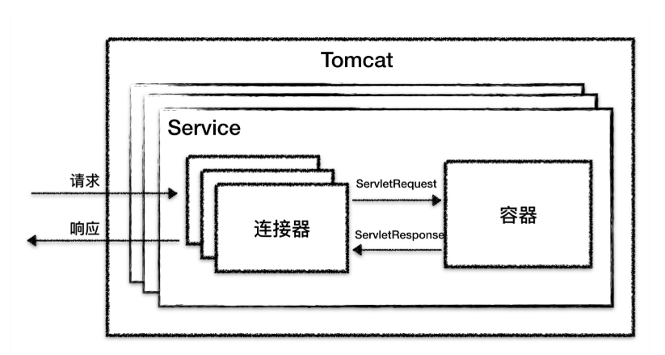
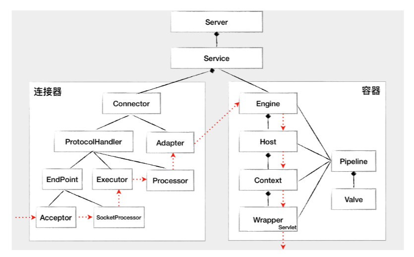

# Tomcat

Tomcat 要实现 2 个核心功能：

- 处理 Socket 连接，负责**网络字节流**与 Request 和 Response 对象的转化。
- 加载和管理 Servlet，以及具体处理 Request 请求。

Tomcat 设计了两个核心组件连接器（Connector）和容器（Container）来分别做这两件事情。

- 连接器负责对外交流；
- 容器负责内部处理。


Tomcat **支持的 I/O 模型**有：

- NIO：非阻塞 I/O，采用 Java NIO 类库实现。
- NIO2：异步 I/O，采用 JDK 7 最新的 NIO2 类库实现。
- APR：采用 Apache 可移植运行库实现，是 C/C++ 编写的本地库。


Tomcat 支持**的应用层协议**有：

- HTTP/1.1：这是大部分 Web 应用采用的访问协议。
- AJP：用于和 Web 服务器集成（如 Apache）。
- HTTP/2：HTTP 2.0 大幅度的提升了 Web 性能。


Tomcat如何实现**支持多种 I/O 模型和应用层协议**

- 一个容器可以对接多个连接器
- 封装到一个Service组件中
- 在 Tomcat 中配置多个 Service，可以实现通过不同的端口号来访问同一台机器上部署的不同应用



最顶层是 Server，这里的 Server 指的就是一个 Tomcat 实例。

一个 Server 中有一个或者多个 Service，一个 Service 中有多个连接器和一个容器。

连接器与容器之间通过标准的 ServletRequest 和 ServletResponse 通信。

## 连接器

连接器对**容器**屏蔽了协议及 I/O 模型等的区别，无论是 HTTP 还是 AJP，在容器中获取到的都是一个标准的 ServletRequest 对象。

连接器的功能：

- 监听网络端口。
- 接受网络连接请求。
- 读取请求网络字节流。
- 根据具体应用层协议（HTTP/AJP）解析字节流，生成统一的 Tomcat Request 对象。
- 将 Tomcat Request 对象转成标准的 ServletRequest。
- 调用 Servlet 容器，得到 ServletResponse。
- 将 ServletResponse 转成 Tomcat Response 对象。
- 将 Tomcat Response 转成网络字节流。
- 将响应字节流写回给浏览器。

Tomcat 的设计者设计了 3 个组件来实现这 3 个功能，分别是`EndPoint、Processor`和`Adapter`。

- 网络通信。
- 应用层协议解析。
- Tomcat `Request/Response` 与 `ServletRequest/ServletResponse` 的转化。

**EndPoint** 负责提供字节流给 Processor

**Processor** 负责提供 Tomcat Request 对象给 Adapter

**Adapter** 负责提供 ServletRequest 对象给容器

三个组件可以进行扩展，以支持更多的协议


Endpoint 和 Processor 放在一起抽象成了 **ProtocolHandler** 组件，专门处理网络连接和应用层协议：

- EndPoint 是通信端点，即通信监听的接口，是具体的 Socket 接收和发送处理器，是对传输层的抽象，因此 EndPoint 是用来实现 TCP/IP 协议的。
- Processor 接收来自 EndPoint 的 Socket，读取字节流解析成 Tomcat Request 和 Response 对象，并通过 Adapter 将其提交到容器处理，Processor 是对应用层协议的抽象。


## Servlet容器

Tomcat 设计了 4 种容器，分别是 Engine、Host、Context 和 Wrapper。这 4 种容器不是平行关系，而是**父子关系**。

- Engine 表示引擎，用来管理多个虚拟站点，一个 Service 最多只能有一个 Engine
- Host 代表的是一个虚拟主机，或者说一个站点，可以给 Tomcat 配置多个虚拟主机地址，而一个虚拟主机下可以部署多个 Web 应用程序；
- Context 表示一个 Web 应用程序；

- Wrapper 表示一个 Servlet，一个 Web 应用程序中可能会有多个 Servlet；


Tomcat 的 `server.xml` 配置文件：

```xml
<Server>							<!--可以包含多个Service-->
	<Service>						<!--可以包含多个Engine，多个连接器-->
    	<Connector></Connector>		<!--连接器组件-->
        <Engine>					<!--包含多个Host-->
        	<Host>					<!--处理特定Host的客户请求-->
            	<Context>			<!--为特定的web应用处理请求-->
                </Context>
            </Host>
        </Engine>
    </Service>
</Server>
```

Tomcat 就是用组合模式来管理这些容器的

Tomcat 是用 Mapper 组件来完成将用户请求的 URL 定位到一个 Servlet，当一个请求到来时，Mapper 组件通过解析请求 URL 里的域名和路径，再到自己保存的 Map 里去查找，就能定位到一个 Servlet。请你注意，一个请求 URL 最后只会定位到一个 Wrapper 容器，也就是一个 Servlet。


域名处理：`http://user.shopping.com:8080/order/buy`

1.  根据协议和端口号选定 Service 和 Engine
2. 根据域名选择Host
3. 根据 URL 路径找到 Context 组件
4. 根据 URL 路径找到 Wrapper（Servlet）




